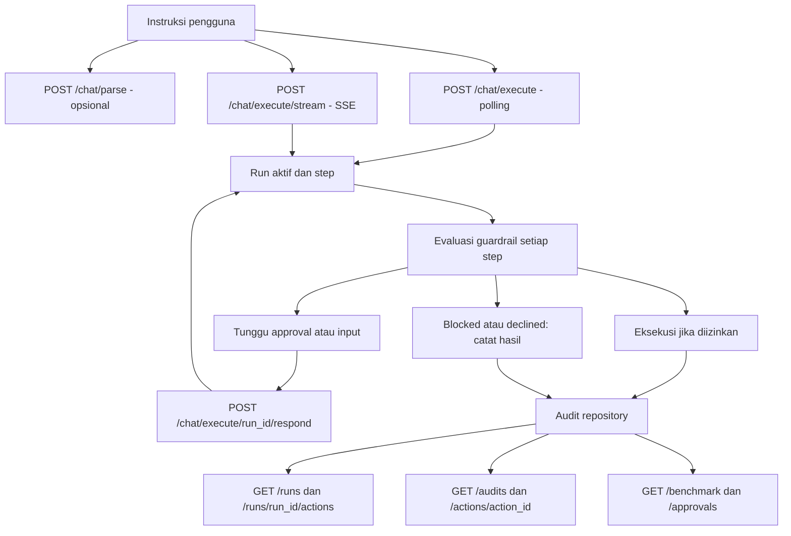
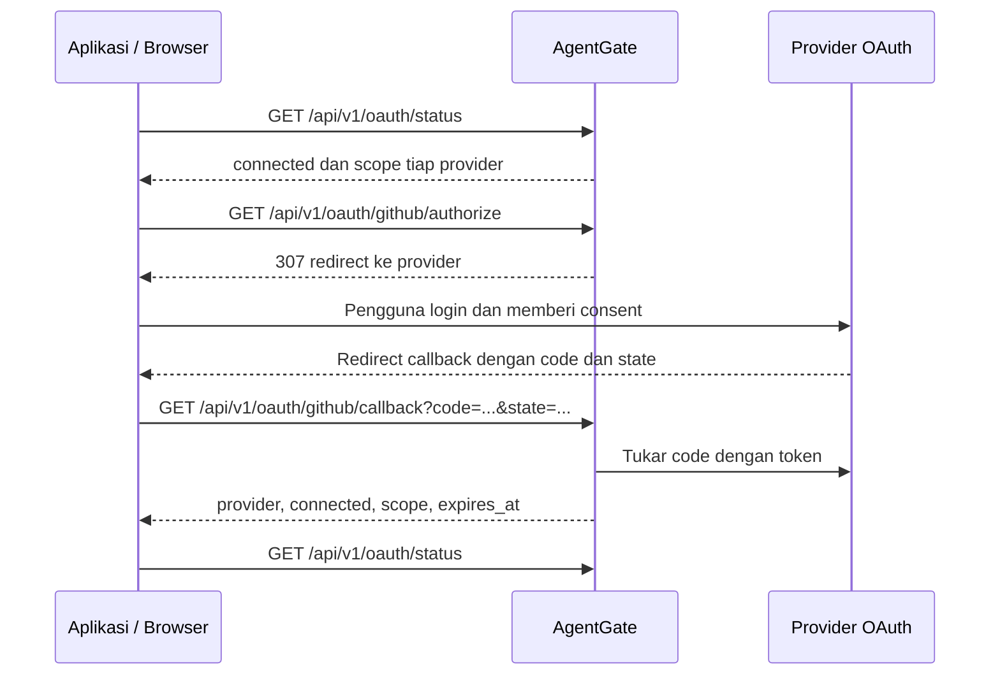
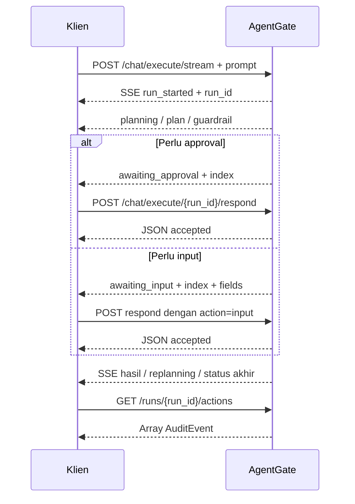

# Dokumentasi Flow API AgentGate

Dokumen ini menjelaskan urutan penggunaan API, hubungan antar-endpoint, data penghubung, percabangan approval, serta pembacaan hasil eksekusi.

## 1. Sumber dan cakupan

- Dokumentasi server: [Swagger UI AgentGate](https://laplace-agentgate.bccdev.id/docs#/).
- Kontrak endpoint: [OpenAPI JSON](https://laplace-agentgate.bccdev.id/openapi.json), dibaca pada 21 September 2026, versi aplikasi `0.1.0`.
- Perilaku internal: router pada `app/api/v1`, schema pada `app/core`, dan service pada `app/domains` di checkout lokal.
- Base URL server: `https://laplace-agentgate.bccdev.id`.
- Prefix API: `/api/v1`. Seluruh path pada tabel dan contoh menggunakan prefix ini, kecuali `/`.

**Status verifikasi server:** OpenAPI aktif pada 21 September 2026 memuat 27 operasi pada 26 path. Tiga endpoint sesi browser dan migrasi `0006` sudah aktif. Berkas implementasi untuk polling, normalisasi action, callback Telegram, dan sesi browser pada proses API sama dengan checkout ini.

Pengujian runtime yang menjadi dasar dokumen:

| Flow | Hasil yang diamati |
|---|---|
| Polling run dengan step | `GET /chat/execute/{run_id}` mengembalikan 200 ketika `running` dan `done`; setiap item memakai bentuk `steps[].data` yang sesuai response model |
| Action nullable | `target: null` dan `payload_summary: null` pada `/actions/run` sama-sama mengembalikan 200 dan dinormalisasi sebelum audit |
| OAuth | Authorize GitHub, Gmail, dan Calendar memakai callback publik HTTPS; koneksi Calendar dan pembuatan acara berhasil diuji melalui server |
| Guardrail | Backend aktif `agentgate` memakai detector Qwen; run Calendar menghasilkan `NEED_APPROVAL` tanpa `evaluation_error`, sedangkan run lama pernah memakai fallback setelah detector timeout |
| Callback Telegram | Prompt masuk dan callback tombol Reject sama-sama diterima webhook dengan 200; run menjadi `declined`, audit `SKIPPED`, dan tidak ada response-validation error |
| Sesi browser | Refresh mengakhiri sesi lama dan membuat sesi baru; sesi lama mendapat 401, sedangkan sesi baru/tanpa sesi mendapat 404 saat membaca action sesi lama; log sesi dan audit tetap tersimpan |

Pengujian tersebut belum mencakup pertukaran OAuth dan action nyata GitHub/Gmail, tombol Approve Telegram, atau webhook Stripe. Callback Reject Telegram memakai jalur callback yang sama dengan Approve sampai `run_registry.respond`; perbedaannya hanya nilai keputusan dan kelanjutan eksekusi.

## 2. Konsep dan hubungan data

| Data | Makna | Diperoleh dari | Digunakan untuk |
|---|---|---|---|
| `prompt` | Instruksi pengguna | Input aplikasi | Body `/chat/parse`, `/chat/execute`, atau `/chat/execute/stream` |
| `run_id` | Identitas satu rangkaian eksekusi | Response execute, frame SSE, atau audit action | State run, respond, filter audit, riwayat actions |
| `action_id` | Identitas sebuah action | Step run atau `AuditEvent` | `GET /actions/{action_id}` |
| `step_index` | Indeks step, mulai dari 0 | `steps[].index` atau `data.index` event SSE | Body `/chat/execute/{run_id}/respond` |
| `audit_id` | Identitas catatan audit | `AuditEvent` | Referensi catatan; belum ada endpoint detail berdasarkan `audit_id` |
| `provider` | Provider OAuth | `github`, `gmail`, atau `calendar` | Authorize, callback, serta pemilihan konektor |
| `X-AgentGate-Owner` | Label owner legacy; bukan autentikasi | Konteks aplikasi pemanggil lama; default literal `default` bila tidak ada header sesi/owner | Mulai run chat dan mengelola resource dalam lingkup legacy |
| `X-AgentGate-Session` | Token acak yang diterbitkan API untuk satu tab halaman demo | `POST /api/v1/sessions` | Membatasi chat, audit, run, approval, benchmark, action, dan koneksi Telegram pada sesi aktif |

### Sesi browser aktif

Halaman demo meminta sesi baru saat dibuka. ID disimpan di `sessionStorage` agar refresh dapat mengakhiri sesi lama lalu membuat ID baru; tombol Reset juga mengakhiri sesi dan menghapus state chat/run aktif. Saat tab ditutup, halaman mencoba mengirim `pagehide` cleanup. Jika browser tidak mengirim cleanup, server mengakhiri sesi setelah 30 menit tanpa aktivitas. Satu tab adalah satu lingkup sesi.

API menyimpan `session_id`, waktu pembuatan, aktivitas terakhir, waktu berakhir, dan alasan berakhir pada tabel `browser_sessions`. Audit action tetap immutable dan menyimpan `owner_id`/`session_id`; mengakhiri sesi menghapus run/chat yang masih di registry, mencabut tautan Telegram yang belum dipakai, dan memutus koneksi Telegram milik sesi, tetapi mempertahankan catatan audit serta baris riwayat sesi.

`X-AgentGate-Session` adalah ID bearer acak untuk isolasi konteks demo, bukan autentikasi pengguna. Siapa pun yang memperoleh ID tersebut dapat bertindak dalam sesi selama masih aktif. Sesi membatasi data aplikasi yang memakai owner ini; token OAuth GitHub/Gmail/Calendar masih berupa konfigurasi global dan belum diisolasi per sesi.

Satu run dapat memiliki banyak step/action. Audit memuat `run_id` dan `action_id` sehingga hasil eksekusi dapat ditelusuri kembali. Endpoint riwayat menghitung **catatan audit**, sehingga `action_count` tidak selalu sama dengan jumlah step rencana yang terlihat saat run masih berjalan.



Diagram memakai path ringkas; tambahkan `/api/v1` dan ganti `run_id`/`action_id` dengan nilai sebenarnya. Kotak parse adalah pratinjau: hasilnya tidak otomatis menjadi run. Halaman demo memanggil `POST /sessions` sebelum flow chat dan mengirim `X-AgentGate-Session` di setiap request yang membaca atau mengubah data sesi.

## 3. Inventaris seluruh endpoint

Kontrak server aktif memiliki **27 operasi pada 26 path**, terdiri dari 14 GET, 12 POST, dan 1 DELETE. Tidak ada PUT atau PATCH.

| Method | Path | Input utama | Output dan hubungan berikutnya |
|---|---|---|---|
| GET | `/` | Tidak ada | OpenAPI backend mendefinisikan metadata `service`, `env`, `version`; Nginx pada domain publik menyajikan frontend HTML untuk path ini |
| GET | `/api/v1/health` | Tidak ada | `{"status":"ok"}`; pemeriksaan layanan |
| POST | `/api/v1/chat/parse` | JSON `prompt` | Rencana dan ringkasan; opsional sebelum execute |
| POST | `/api/v1/chat/execute` | JSON `prompt`; `X-AgentGate-Session` atau owner legacy opsional | `run_id` dan endpoint pelacakan; lanjut GET state dengan konteks yang sama |
| POST | `/api/v1/chat/execute/stream` | JSON `prompt`; `X-AgentGate-Session` atau owner legacy opsional | Membuat run dan mengirim SSE; lanjut respond dengan konteks yang sama bila perlu |
| POST | `/api/v1/sessions` | Tidak ada | Membuat sesi browser baru dan menyimpan catatan lifecycle di database |
| POST | `/api/v1/sessions/heartbeat` | Header `X-AgentGate-Session` | Memastikan sesi masih aktif dan memperbarui aktivitas |
| POST | `/api/v1/sessions/end` | JSON `session_id`, `reason` | Mengakhiri sesi; dipakai Reset, refresh, dan cleanup `pagehide` |
| GET | `/api/v1/chat/execute/{run_id}` | Path `run_id`; konteks owner/sesi yang sama dengan pembuat run | Status run dan step; konteks lain mendapat 404 |
| POST | `/api/v1/chat/execute/{run_id}/respond` | Path `run_id`; konteks yang sama; JSON `step_index`, `action`, input opsional | Menerima jawaban hanya jika run berada dalam lingkup pemanggil |
| POST | `/api/v1/actions/run` | Proposal action terstruktur; header sesi opsional | `AuditEvent` dalam lingkup sesi; lanjut GET action/audit/riwayat |
| POST | `/api/v1/actions/prototype/browser` | URL dan spesifikasi browser action; header sesi opsional | `AuditEvent` dalam lingkup sesi |
| GET | `/api/v1/actions/{action_id}` | Path `action_id`; header sesi opsional | Detail action milik sesi; 404 jika berbeda lingkup |
| GET | `/api/v1/runs` | Header sesi opsional | Ringkasan run berdasarkan audit milik sesi |
| GET | `/api/v1/runs/{run_id}/actions` | Path `run_id`; header sesi opsional | Audit run milik sesi; hasil sesi lain disembunyikan |
| GET | `/api/v1/audits` | Query `run_id`, header sesi opsional | Audit dalam lingkup sesi |
| GET | `/api/v1/audits/latest` | Header sesi opsional | Audit terakhir dalam lingkup sesi atau `{}` |
| GET | `/api/v1/approvals` | Header sesi opsional | Audit approval yang masih pending dalam lingkup sesi |
| GET | `/api/v1/benchmark` | Header sesi opsional | Ringkasan audit dalam lingkup sesi |
| GET | `/api/v1/oauth/status` | Tidak ada | Status koneksi `github`, `gmail`, `calendar` |
| GET | `/api/v1/oauth/{provider}/authorize` | Path provider | Redirect 307 ke halaman consent provider |
| GET | `/api/v1/oauth/{provider}/callback` | Path provider; query `code`, `state` | Hasil pertukaran token; lanjut GET OAuth status |
| POST | `/api/v1/telegram/connect` | Header sesi atau owner legacy opsional; tanpa body | `connect_url`, `expires_at`; buka tautan Telegram |
| GET | `/api/v1/telegram/connection` | Header sesi atau owner legacy opsional | `connected`, `username`, `display_name` dalam lingkup owner |
| DELETE | `/api/v1/telegram/connection` | Header sesi atau owner legacy opsional | Status koneksi setelah disconnect |
| POST | `/api/v1/telegram/webhook` | JSON Telegram update dan secret header | Penerimaan update, kemungkinan `run_id`/keputusan |
| POST | `/api/v1/stripe/webhook` | Raw body Stripe event dan signature header | `processed`/`duplicate`, `event_id`, `event_type` |

Operasi bisnis menggunakan POST untuk memulai proses atau memberi respons. GET umumnya membaca data, tetapi endpoint OAuth authorize/callback menjalankan proses koneksi. DELETE yang tersedia hanya untuk memutus koneksi Telegram. Mengakhiri sesi menghapus run aktif dari registry, tetapi tidak menghapus audit log yang sudah tersimpan.

## 4. Flow persiapan aplikasi dan OAuth

### 4.1 Pemeriksaan awal

1. Buka `/` pada domain publik untuk halaman demo. Metadata JSON pada operasi root tersedia saat mengakses backend langsung; Nginx publik memetakan `/` ke frontend.
2. `GET /api/v1/health` untuk memeriksa respons layanan.
3. Jika aksi membutuhkan GitHub, Gmail, atau Calendar, baca `GET /api/v1/oauth/status`.
4. Hubungkan provider yang dibutuhkan sebelum menjalankan aksi terkait.

Health lokal hanya mengembalikan status statis `ok`; respons ini tidak membuktikan bahwa LLM, database, browser, atau seluruh konektor siap.

### 4.2 Menghubungkan provider



- Jalankan authorize sebagai navigasi browser agar pengguna dapat menyelesaikan consent.
- Provider mengisi `code` dan `state`; aplikasi tidak membuat nilai callback sendiri.
- Token disimpan backend dan digunakan konektor saat action berjalan. Response callback tidak mengembalikan access token.
- Callback mengembalikan 400 jika pertukaran token/state gagal, dan 422 bila parameter tidak valid.
- Implementasi lokal menentukan `connected` dari keberadaan record token. Nilai `true` bukan hasil pemeriksaan langsung ke provider bahwa token masih berlaku.
- Tidak ada endpoint OAuth disconnect/refresh publik dalam kontrak ini.

Redirect URI yang dipakai deployment aktif:

| Provider | Callback |
|---|---|
| GitHub | `https://laplace-agentgate.bccdev.id/api/v1/oauth/github/callback` |
| Gmail | `https://laplace-agentgate.bccdev.id/api/v1/oauth/gmail/callback` |
| Calendar | `https://laplace-agentgate.bccdev.id/api/v1/oauth/calendar/callback` |

Ketiga URL di atas telah diverifikasi dari response authorize aktif. Flow Calendar juga telah diuji sampai status terhubung dan pembuatan acara berhasil. Token ketiga provider masih disimpan sebagai konfigurasi global aplikasi, bukan per sesi browser.

## 5. Flow chat: pratinjau rencana

`POST /api/v1/chat/parse` menerima:

```json
{
  "prompt": "Read file sample.txt"
}
```

`prompt` wajib, panjang 1–1000 karakter. Bentuk yang sama digunakan pada kedua endpoint execute.

Response parse berisi:

| Field | Isi |
|---|---|
| `plan` | Array langkah atomik dari planner |
| `summary` | Ringkasan rencana untuk pengguna |
| `steps` | Jumlah langkah dalam hasil parse |
| `target` | Target utama, misalnya URL atau path |
| `action_type` | Jenis aksi utama |
| `llm_provider` | Provider LLM yang digunakan |
| `raw_prompt` | Prompt asli |

Parse tidak mengeksekusi action, tidak membuat `run_id`, dan tidak menghasilkan audit eksekusi. Untuk menjalankan, kirim prompt ke **salah satu** endpoint execute. Body execute tidak menerima `plan` sebagai kontrak input. Planner dijalankan kembali, sehingga hasil eksekusi dapat berbeda dari pratinjau dan dapat berubah saat replanning.

## 6. Flow chat dengan polling

Pilihan ini cocok bila aplikasi memantau status melalui request GET berkala.

### 6.1 Mulai run

```http
POST /api/v1/chat/execute
Content-Type: application/json

{"prompt":"Read file sample.txt"}
```

Contoh bentuk response, dengan ID ilustratif:

```json
{
  "run_id": "run_634a174c8449",
  "status": "running",
  "prompt": "Read file sample.txt",
  "stream_endpoint": "/api/v1/chat/execute/stream",
  "respond_endpoint": "/api/v1/chat/execute/run_634a174c8449/respond",
  "state_endpoint": "/api/v1/chat/execute/run_634a174c8449"
}
```

HTTP 200 berarti run berhasil dimulai; action belum tentu selesai atau berhasil. Simpan `run_id`, `state_endpoint`, dan `respond_endpoint`.

### 6.2 Baca status dan lanjutkan

1. Panggil `GET /api/v1/chat/execute/{run_id}`.
2. Baca `status` run serta `steps[]`: `index`, `action_id`, `status`, data, decision, dan execution sesuai kontrak.
3. Jika step `waiting_approval`, tampilkan pilihan approve/decline.
4. Jika step `waiting_input`, tampilkan input sesuai kebutuhan step.
5. Kirim keputusan ke endpoint respond; terus baca state run yang sama.
6. Berhenti polling saat run terminal: `done`, `failed`, `blocked`, `declined`, `error`, atau `cancelled`.
7. Ambil audit melalui `GET /api/v1/runs/{run_id}/actions` atau `GET /api/v1/audits?run_id={run_id}`.

Interval polling 1–2 detik dapat menjadi pilihan aplikasi; API tidak menetapkan interval wajib.

Response state membungkus parameter action di `steps[].data`, terpisah dari `index`, `action_id`, `status`, `decision`, `execution`, `sanitize_fields`, dan `audit_event`. Bentuk ini telah diuji pada run yang memiliki step ketika masih `running` dan setelah `done`; keduanya mengembalikan HTTP 200. Status `running` dengan `decision: null` berarti planner/guardrail belum selesai, bukan kegagalan polling.

Gunakan `X-AgentGate-Session` yang sama pada execute, state, dan respond. Sesi lain atau request tanpa konteks yang sesuai menerima 404 agar keberadaan run tidak dibocorkan; sesi yang sudah berakhir menerima 401.

**Penting:** menurut implementasi lokal, `stream_endpoint` pada response bukan URL subscribe ke run yang baru dibuat. Memanggil POST endpoint stream dengan prompt membuat **run baru**. Untuk satu eksekusi, pilih execute + polling atau langsung execute/stream.

## 7. Flow chat dengan streaming SSE

### 7.1 Mulai run sekaligus membaca stream

```http
POST /api/v1/chat/execute/stream
Content-Type: application/json
Accept: text/event-stream

{"prompt":"Read file sample.txt"}
```

Gunakan klien yang mendukung POST dan pembacaan response bertahap, misalnya `fetch` dengan `ReadableStream`. `EventSource` browser standar menggunakan GET sehingga tidak langsung cocok untuk endpoint ini.

Contoh frame SSE berdasarkan formatter lokal:

```text
event: run_started
data: {"run_id":"run_634a174c8449","type":"run_started","data":{"status":"running"}}

event: step_status
data: {"run_id":"run_634a174c8449","type":"step_status","data":{"run_id":"run_634a174c8449","index":0,"status":"waiting_approval"}}

```

Ambil `run_id` dari frame pertama. Frame dipisahkan baris kosong; satu potongan jaringan dapat berisi sebagian frame atau beberapa frame sekaligus. Parse setelah frame lengkap tersedia.

### 7.2 Event dan tindakan aplikasi

| Event | Makna | Tindakan aplikasi |
|---|---|---|
| `run_started` | Run telah dibuat | Simpan `run_id` |
| `planning` | Planner sedang menyusun langkah | Tampilkan proses perencanaan |
| `plan` | Rencana/step tersedia | Tampilkan atau perbarui daftar step |
| `guardrail` | Hasil evaluasi kebijakan | Tampilkan decision dan alasan |
| `step_status` | Status step berubah | Perbarui step menggunakan `data.index` |
| `awaiting_approval` | Menunggu persetujuan | POST respond dengan approve/decline |
| `awaiting_input` | Memerlukan isian/klarifikasi | Baca `data.fields`, kirim input lewat respond |
| `executing` | Eksekusi sedang berjalan | Tampilkan indikator eksekusi |
| `step_result` | Hasil action tersedia | Tampilkan hasil, simpan referensi audit |
| `replanning` | Rencana diperbarui berdasarkan observasi | Tunggu event plan berikutnya |
| `done` | Lifecycle run berakhir | Baca status akhir; event ini tidak selalu berarti sukses |
| `error` | Terjadi error lifecycle | Tampilkan pesan dan hentikan pembacaan stream |

Event di atas berasal dari kode lokal. Urutannya bergantung percabangan; approval/input terjadi sebelum action terkait dieksekusi, dan sebagian event dapat berulang.

Heartbeat berbentuk komentar SSE `: ping`, bukan JSON dan bukan perubahan status.

### 7.3 Interaksi selama stream terbuka



Koneksi SSE tetap terbuka saat request respond dikirim melalui koneksi HTTP lain. Pada kode lokal, disconnect SSE ketika run masih berjalan/menunggu membatalkan task dan menetapkan run `cancelled`. Tidak ada kontrak resume SSE atau `Last-Event-ID`; mengulang POST stream dapat menjalankan instruksi lagi.

## 8. Flow approval, penolakan, dan input

Seluruh respons interaktif menggunakan:

```text
POST /api/v1/chat/execute/{run_id}/respond
```

### 8.1 Menyetujui atau menolak

Untuk step berstatus `waiting_approval`:

```json
{"step_index":0,"action":"approve"}
```

Atau:

```json
{"step_index":0,"action":"decline"}
```

Approve melanjutkan step sesuai lifecycle. Decline pada implementasi lokal menghentikan run dengan status `declined` dan mencatat action sebagai `SKIPPED`.

### 8.2 Mengisi nilai atau klarifikasi

Untuk step berstatus `waiting_input`:

```json
{
  "step_index": 1,
  "action": "input",
  "fields": {"email":"user@example.com"}
}
```

Nama key harus mengikuti field yang diminta run. Untuk satu field, dapat menggunakan:

```json
{"step_index":1,"action":"input","text":"user@example.com"}
```

`step_index` wajib dan minimal 0. `action` hanya menerima `approve`, `decline`, atau `input`. Action input memerlukan `fields` atau `text`; approve/decline tidak boleh membawa isian tersebut. Setelah input, guardrail dapat mengevaluasi ulang dan meminta approval lagi.

Contoh bentuk response:

```json
{
  "run_id": "run_634a174c8449",
  "step_index": 0,
  "action": "approve",
  "status": "accepted",
  "step_status": "waiting_approval"
}
```

`accepted` menyatakan jawaban telah diteruskan ke lifecycle. `step_status` bisa masih berstatus menunggu saat response dibuat karena task berjalan asynchronous. Pantau SSE/GET state untuk hasil berikutnya.

### 8.3 Hubungan dengan GET approvals

`GET /api/v1/approvals` hanya memfilter audit repository berdasarkan `PENDING_APPROVAL`. Endpoint ini tidak menyetujui action dan tidak menjamin daftar seluruh step run aktif yang sedang menunggu.

Pada lifecycle chat lokal, step dapat menunggu sebelum audit final ditulis. Sebaliknya, action langsung dapat memiliki audit pending tanpa sesi interaktif yang bisa dilanjutkan. Gunakan live state/SSE untuk approval chat; jangan mengasumsikan setiap item `/approvals` dapat dikirim ke `/respond`.

### 8.4 Backend guardrail aktif

Deployment memakai `GUARDRAIL_BACKEND=agentgate`. Backend ini menjalankan rule/policy dan detector Qwen yang dikonfigurasi melalui `AGENTGATE_LLM_DETECTOR_MODEL`; `GUARDRAIL_LLM_ENABLED` hanya berlaku pada backend `legacy`, sehingga nilai `False` pada setting tersebut tidak mematikan detector Qwen ketika backend yang dipilih adalah `agentgate`.

Alasan keputusan dapat menggabungkan hasil rule, domain/risk hint, dan detector. Jika detector timeout atau tidak tersedia, engine mencatat kegagalan detector dan memakai jalur kebijakan yang tetap tersedia; pesan timeout tidak berarti detector sengaja dinonaktifkan. Pada pengujian Calendar melalui bot, Qwen menyelesaikan evaluasi dan menghasilkan `NEED_APPROVAL` dengan `evaluation_error: null`.

## 9. Flow action terstruktur langsung

Gunakan `POST /api/v1/actions/run` bila pemanggil sudah mengetahui konektor, jenis action, dan payload tanpa perlu planner chat.

```http
POST /api/v1/actions/run
Content-Type: application/json

{
  "target_system": "local_file",
  "action_type": "FILE_READ",
  "target": "sample.txt",
  "payload": {"action":"read","path":"sample.txt"},
  "user_goal": "read demo file",
  "risk_hint": "file_read"
}
```

File contoh harus tersedia di lokasi yang diizinkan konfigurasi konektor. Respons aktual bergantung pada kebijakan dan lingkungan.

| Field proposal | Wajib/default | Kegunaan |
|---|---|---|
| `target_system` | Wajib | Konektor, misalnya local_file/browser/github/gmail/calendar/stripe |
| `action_type` | Wajib | Jenis action, misalnya FILE_READ atau API_CALL |
| `target` | Opsional; bila dihilangkan atau `null`, menjadi `target_system` | Path, URL, identifier, atau objek target |
| `payload` | Default `{}` | Parameter spesifik konektor/action |
| `run_id`, `action_id` | Opsional | Identitas dapat diberikan; backend membuatnya bila tidak disediakan |
| `domain` | Opsional | Domain kebijakan |
| `source` | Default model `cli` | Asal proposal |
| `user_goal`, `content_context` | Default string kosong | Konteks evaluasi |
| `payload_summary` | Opsional; bila dihilangkan atau `null`, dibuat dari key `payload` | Ringkasan payload |
| `recipient_reference`, `resolved_recipient` | Opsional | Referensi dan metadata penerima |
| `risk_hint` | Default `unknown` | Petunjuk klasifikasi risiko |
| `rollback_available` | Default `false` | Ada/tidaknya strategi rollback |
| `confidence` | Default `1.0`, rentang 0–1 | Tingkat keyakinan proposal |

Model mengizinkan field tambahan, tetapi field tambahan tidak otomatis memiliki perilaku khusus. Tidak ada kontrak publik `approved=true` untuk melewati guardrail.

Normalisasi nullable telah diverifikasi pada server aktif: `target: null` menjadi nilai `target_system`, sedangkan `payload_summary: null` dibuat dari nama key dalam `payload`. Keduanya menghasilkan response 200 dan audit normal, sama seperti ketika field tersebut dihilangkan.

Flow internal lokal:

```text
POST /actions/run
  -> build_action_request (normalisasi dan identitas)
  -> evaluasi guardrail
  -> ExecutionRouter
  -> konektor/browser jika diizinkan
  -> tulis AuditEvent dan trace
  -> kembalikan AuditEvent
```

| Decision | Hasil jalur langsung |
|---|---|
| `ALLOW` | Eksekusi; hasil dapat SUCCESS, FAILED, atau status executor lain |
| `BLOCK` | Tidak dieksekusi; audit BLOCKED |
| `NEED_APPROVAL` | Tidak dieksekusi; audit PENDING_APPROVAL |
| `SANITIZE` | Tidak langsung dieksekusi; audit SANITIZED untuk preview yang disanitasi |
| `ASK_USER` | Tidak dieksekusi; audit WAITING_USER |

Endpoint ini mengembalikan audit setelah pipeline selesai dan tidak membuat sesi chat interaktif. Memberikan `run_id` yang sama hanya mengelompokkan audit; tidak otomatis membuat run registry atau step yang dapat di-respond. Gunakan flow chat bila perlu approval/input yang dapat dilanjutkan.

Setelah response, gunakan `action_id` untuk `GET /actions/{action_id}` dan `run_id` untuk `GET /runs/{run_id}/actions`.

## 10. Flow browser prototype

`POST /api/v1/actions/prototype/browser` menjalankan jalur browser khusus dengan inspeksi snapshot, klasifikasi risiko, dan audit.

```json
{
  "url": "https://example.com",
  "user_goal": "Inspect example page",
  "action": {"type":"screenshot","path":"data/browser/screenshots/example.png"},
  "risk_hint": "unknown",
  "timeout_ms": 15000,
  "wait_until": "domcontentloaded"
}
```

- `url` wajib.
- Gunakan `action` untuk satu aksi atau `actions` untuk array urutan aksi. Jangan mengisi keduanya sekaligus dengan nilai nonkosong.
- Kedua field action opsional menurut schema; contoh sebaiknya selalu menyatakan aksi yang diinginkan.
- `timeout_ms` memiliki batas 1.000–60.000 ms; default berasal dari konfigurasi server.
- `wait_until`: `commit`, `domcontentloaded`, `load`, atau `networkidle`; default dari konfigurasi.
- Output berupa `AuditEvent`, bukan SSE atau response mulai run chat.
- Hasilnya terhubung ke endpoint audit/action/run melalui ID pada response.

## 11. Flow histori, audit, dan dashboard

```text
GET /api/v1/runs
  -> pilih run_id
GET /api/v1/runs/{run_id}/actions
  -> pilih action_id
GET /api/v1/actions/{action_id}
```

Alternatif membaca audit satu run:

```text
GET /api/v1/audits?run_id={run_id}
```

Pada kode lokal, query audit berfilter dan list run actions membaca repository dengan filter yang sama.

### 11.1 Bentuk AuditEvent

| Field | Fungsi |
|---|---|
| `audit_id`, `run_id`, `action_id` | Korelasi catatan, run, dan action |
| `request_json` | Proposal/request yang dicatat |
| `decision_json` | Keputusan guardrail, risiko, alasan, kebijakan |
| `execution_json` | Status dan hasil executor, termasuk error bila tersedia |
| `execution_status` | Status action dalam huruf kapital |
| `error_type` | Kategori error opsional |
| `latency` | Pengukuran waktu, termasuk `total_ms` bila tersedia |
| `created_at` | Waktu pencatatan |
| `schema_version`, `policy_version`, `detector_version` | Versi untuk penelusuran hasil |

Jangan mengandalkan audit sebagai salinan utuh payload input: serialisasi lokal mengecualikan payload pada ActionRequest, dan sebagian data tampilan dimasking.

### 11.2 Perbedaan live state dan riwayat

| Endpoint | Sumber lokal | Arti status |
|---|---|---|
| `/chat/execute/{run_id}` | Run registry dalam memori | Status keseluruhan lifecycle run, misalnya `waiting_input` |
| `/runs` | Agregasi audit repository | `latest_status` dari audit terakhir run, misalnya `SUCCESS` |
| `/runs/{run_id}/actions` | Audit repository | Status masing-masing action yang sudah tercatat |

Run yang baru dimulai bisa belum muncul di `/runs` karena belum ada audit. Registry lokal dapat hilang ketika proses restart atau sesi dikeluarkan karena batas kapasitas; audit dapat tetap tersedia tergantung backend penyimpanan. HTTP 404 pada live state tidak otomatis berarti tidak ada histori run.

`GET /audits/latest` membaca audit terakhir dalam lingkup owner/sesi, sehingga tidak cocok untuk menentukan hasil run tertentu ketika beberapa run berjalan bersamaan. Jika kosong, response `{}`.

### 11.3 Benchmark

`GET /api/v1/benchmark` mengembalikan:

```json
{"action_count":10,"avg_total_ms":45,"latest_status":"SUCCESS"}
```

Angka di atas ilustratif. Implementasi menghitung jumlah audit dan rata-rata integer `latency.total_ms`; nilai yang tidak tersedia dihitung sebagai 0. Jika repository kosong: `action_count=0`, `avg_total_ms=0`, `latest_status=null`. Endpoint ini tidak memicu benchmark baru.

## 12. Flow Telegram

### 12.1 Menghubungkan akun — deployment aktif

1. `GET /api/v1/telegram/connection` dengan header `X-AgentGate-Session` dari sesi browser aktif.
2. Bila belum terhubung, `POST /api/v1/telegram/connect` dengan session ID yang sama.
3. Baca `connect_url` dan `expires_at` dari response.
4. Buka `connect_url` di Telegram dan selesaikan interaksi bot.
5. Baca ulang GET connection hingga status koneksi diketahui.
6. Saat memulai chat run, frontend demo memakai session ID yang sama agar run dan koneksi Telegram berada di lingkup tersebut. Klien lama tetap dapat memakai `X-AgentGate-Owner`.
7. Untuk disconnect, panggil `DELETE /api/v1/telegram/connection`, lalu baca status terbaru.

`X-AgentGate-Owner` tanpa sesi adalah konteks kompatibilitas dan bukan autentikasi. Browser session yang berakhir akan memutus koneksi Telegram untuk sesi itu. Status koneksi OAuth tetap global pada deployment dan belum termasuk isolasi sesi.

Karena refresh halaman mengakhiri sesi lama, koneksi Telegram milik sesi tersebut juga diputus. Hubungkan kembali Telegram setelah refresh bila flow browser baru memerlukannya.

### 12.2 Update masuk dan approval bot — deployment aktif

```text
Pengguna mengirim pesan Telegram
  -> Telegram POST /api/v1/telegram/webhook
  -> validasi secret header
  -> periksa update duplikat / jenis pesan
  -> service membuat run melalui start_agent_run
  -> agent menjalankan lifecycle guardrail
  -> bot menyampaikan progres / permintaan approval
  -> pengguna menekan tombol approval
  -> Telegram mengirim callback_query ke webhook yang sama
  -> service memanggil run_registry.respond
  -> run dilanjutkan atau ditolak
```

Webhook menggunakan header `X-Telegram-Bot-Api-Secret-Token`. Bentuk payload update dapat memiliki `update_id`, `message`, atau `callback_query`. Update pesan yang diterima dapat mengembalikan `run_id`; hasil run kemudian terkait dengan endpoint state dan audit yang sama seperti chat.

Response memiliki `ok`, `status`, serta field opsional `run_id`, `decision`, dan `step_index`. Nilai `status` pada webhook:

- `accepted`: update pesan diterima, atau update ditangani tanpa membuat run baru.
- `ignored`: update tidak didukung atau tidak relevan setelah autentikasi berhasil.
- `duplicate`: update Telegram yang sama sudah pernah diproses.
- `callback_accepted`: tombol approve/decline valid berhasil diterapkan; response menyertakan `run_id` dan `step_index`.
- `callback_rejected`: callback tidak dapat diterapkan, misalnya run/step tidak ditemukan, konteks tidak cocok, atau step tidak lagi menunggu approval.
- `callback_ignored`: payload callback tidak didukung.
- `callback_duplicate`: keputusan untuk run/step tersebut sudah pernah diproses.

Secret salah menghasilkan 403; konfigurasi secret kosong menghasilkan 503. JSON yang tidak valid menghasilkan `ignored` pada router lokal setelah autentikasi berhasil. Approval callback memakai registry yang sama dengan REST respond, tetapi service memanggilnya langsung tanpa request HTTP internal ke endpoint respond. Pada service lokal, kebutuhan input diarahkan ke aplikasi AgentGate untuk melanjutkan step.

Status `callback_accepted` berarti keputusan tombol berhasil diterapkan, baik keputusannya `approve` maupun `decline`. Pada uji nyata 21 September 2026, prompt Calendar yang dikirim langsung ke bot menghasilkan run `run_ea10aade9c11`. Update pesan dan callback tombol Reject masing-masing diterima webhook dengan HTTP 200; callback mengubah run menjadi `declined`, menyimpan `approval_decision=declined`, dan mencatat action sebagai `SKIPPED` tanpa membuat acara Calendar.

Run yang dimulai dari pesan Telegram saat ini dibuat sebagai channel Telegram tanpa `session_id` browser. Baca live state run tersebut tanpa `X-AgentGate-Session`; mengirim header sesi browser akan menghasilkan 404 karena konteksnya berbeda. Jangan restart proses API antara munculnya tombol dan penekanan tombol karena run registry masih berada di memori.

## 13. Flow Stripe webhook

```text
Peristiwa pembayaran terjadi di Stripe
  -> Stripe POST /api/v1/stripe/webhook
  -> AgentGate membaca raw body persis seperti dikirim
  -> validasi Stripe-Signature dengan webhook secret
  -> validasi event_id dan event_type
  -> repository memproses/menyimpan event dan mendeteksi duplikat
  -> response processed atau duplicate
```

Header: `Stripe-Signature: t=...,v1=...`. Walaupun parameter header ditampilkan opsional pada schema, signature diperlukan oleh service lokal. Signature diverifikasi atas byte body asli.

Contoh bentuk response:

```json
{
  "ok": true,
  "status": "processed",
  "event_id": "evt_example",
  "event_type": "payment_intent.succeeded"
}
```

- `processed` berarti event diproses repository; bukan pernyataan bahwa semua jenis event merupakan pembayaran sukses.
- Event duplikat menghasilkan `status=duplicate`.
- Signature hilang/salah atau payload tidak valid: 400.
- Secret tidak dikonfigurasi atau proses penyimpanan gagal: 503.
- Endpoint webhook tidak membuat chat run dan response tidak menyediakan `run_id`/`action_id`.
- Action keluar menuju Stripe dapat melalui guarded action/konektor; webhook masuk adalah proses penerimaan event terpisah. Kontrak ini belum menyediakan endpoint GET payment publik atau jaminan korelasi webhook ke run tertentu.

## 14. Status dan penanganan error

### 14.1 Tiga jenis status yang berbeda

| Jenis | Nilai |
|---|---|
| RunStatus | `running`, `waiting_approval`, `waiting_input`, `done`, `failed`, `blocked`, `declined`, `error`, `cancelled` |
| StepStatus | `pending`, `running`, `waiting_approval`, `waiting_input`, `approved`, `declined`, `done`, `failed`, `blocked`, `skipped` |
| ExecutionStatus audit | `SUCCESS`, `FAILED`, `SKIPPED`, `BLOCKED`, `PENDING_APPROVAL`, `SANITIZED`, `WAITING_USER` |

Contoh: sebuah run `declined` dapat memiliki audit action `SKIPPED`. Step `approved` baru berarti persetujuan diberikan, belum membuktikan eksekusi sukses. UI perlu membaca status sesuai objeknya.

### 14.2 Respons HTTP

| HTTP | Kondisi | Langkah pemanggil |
|---|---|---|
| 200 | Request berhasil diproses/diterima | Tetap periksa status bisnis, run, atau audit |
| 401 | Header sesi wajib tidak ada, ID sesi tidak valid, kedaluwarsa, atau sudah berakhir | Buat sesi baru sebelum mengulang request |
| 307 | Authorize OAuth | Lanjutkan redirect di browser |
| 400 | Callback OAuth gagal; Stripe signature/payload salah; owner legacy tidak valid; session ID dikirim melalui header owner | Periksa callback/configuration, payload, atau header identitas |
| 403 | Secret Telegram salah | Periksa konfigurasi webhook pengirim |
| 404 | Run/step/action tidak ditemukan | Periksa ID; untuk run, periksa histori audit bila sesi sudah hilang |
| 409 | Step tidak menunggu jenis respons tersebut | Baca state terbaru sebelum menawarkan aksi lagi |
| 422 | Validasi body/path/query/header gagal | Perbaiki field sesuai detail validasi |
| 503 | Konfigurasi webhook belum siap atau proses Stripe tidak tersedia | Periksa konfigurasi/service backend |

Error HTTP biasanya membawa `detail`; validasi dapat berisi array detail dengan lokasi field. Setelah koneksi SSE terbuka, error lifecycle dapat dikirim sebagai event `error`, bukan mengganti status HTTP response yang sudah dikirim.

Run dan penantian jawaban juga memiliki timeout berdasarkan konfigurasi `AGENT_RUN_TIMEOUT_SEC` dan `AGENT_WAIT_RESPONSE_TIMEOUT_SEC`. Kode lokal menetapkan run `error` untuk timeout keseluruhan, dan `failed` untuk timeout menunggu jawaban. Jangan membiarkan UI terus menampilkan menunggu setelah status terminal.

Planner dan detector guardrail memiliki timeout terpisah. Perubahan environment seperti `LLM_TIMEOUT` atau `AGENTGATE_LLM_DETECTOR_TIMEOUT` baru berlaku setelah proses/container API dibuat ulang. Selama evaluasi, live state tetap dapat dibaca dengan status step `running` dan `decision: null`. Pada uji callback Telegram, detector Qwen selesai tanpa `evaluation_error` dalam sekitar 348 detik; keterlambatan tombol berasal dari evaluasi guardrail, bukan webhook Telegram. Uji tersebut berjalan pada proses lama yang masih memuat timeout 600 detik. Deployment aktif telah direcreate dan sekarang memuat `AGENTGATE_LLM_DETECTOR_TIMEOUT=60`.

Tidak ada kontrak idempotency umum pada endpoint mulai chat/action. Pengulangan POST setelah timeout jaringan dapat mengeksekusi instruksi dua kali. Bila `run_id` sudah diperoleh, baca state/riwayat terlebih dahulu; deduplikasi webhook tidak berarti endpoint lain juga terdeduplikasi.

## 15. Batas implementasi yang masih berlaku

Hal berikut masih perlu diperhatikan saat mengintegrasikan deployment aktif:

1. **Petunjuk stream pada execute:** deskripsi menyebut pelacakan streaming, tetapi implementasi POST stream membuat run baru tanpa parameter `run_id`. Jangan memperlakukan response `stream_endpoint` sebagai subscription run lama.
2. **Approval audit versus sesi aktif:** audit pending tidak otomatis memiliki waiter dan step interaktif yang valid. Tidak ada endpoint `POST /approvals/{id}/approve` pada kontrak.
3. **Scenarios:** `v1/scenarios.py` masih berisi placeholder; belum ada endpoint scenarios di OpenAPI maupun router utama.
4. **OAuth global:** token GitHub, Gmail, dan Calendar belum dipisahkan per browser session.
5. **Run inbound Telegram:** pesan langsung ke bot membuat run channel Telegram yang belum dipetakan ke `X-AgentGate-Session`; run tersebut memakai konteks legacy dan tidak muncul dalam live state sesi browser.
6. **Registry in-memory:** state run aktif, waiter approval, dan deduplikasi callback tidak bertahan saat proses API direstart. Audit yang sudah ditulis tetap berada di database.

## 16. Urutan integrasi yang disarankan

| Kebutuhan aplikasi | Urutan API |
|---|---|
| Mulai halaman demo | POST sessions → simpan `session_id` → kirim `X-AgentGate-Session` pada request scoped → POST sessions/end saat refresh/reset/close |
| Pratinjau instruksi | POST parse → tampilkan plan |
| Eksekusi dengan polling | POST execute → GET state berulang → POST respond bila perlu → GET run actions |
| Eksekusi dengan progres langsung | POST execute/stream → baca SSE → POST respond bila perlu → tunggu terminal → GET run actions |
| Eksekusi proposal terstruktur | POST actions/run → baca AuditEvent → GET action bila ingin membuka detail kembali |
| Prototype browser | POST actions/prototype/browser → baca AuditEvent |
| Riwayat pengguna/dashboard | GET runs → GET run actions → GET action |
| Statistik audit | GET benchmark; GET audits bila butuh detail |
| Hubungkan provider | GET oauth/status → GET authorize → callback provider → GET oauth/status |
| Hubungkan Telegram di server | GET connection → POST connect → buka connect_url → GET connection |
| Putus Telegram di server | DELETE connection → GET connection |
| Approval dari bot Telegram | Kirim prompt ke bot → tunggu tombol → tekan Approve/Reject → webhook callback → baca state tanpa header sesi browser |

## 17. Referensi kode

Path berikut relatif terhadap file dokumentasi ini:

- [Registrasi router dan metadata aplikasi](../main.py).
- [Router chat: parse, execute, stream, state, respond](v1/chat.py).
- [Router action dan browser prototype](v1/actions.py).
- [Router histori run](v1/runs.py), [audit](v1/audits.py), [approvals](v1/approvals.py), [benchmark](v1/benchmark.py).
- [Router OAuth](v1/oauth.py), [Telegram](v1/telegram.py), [Stripe](v1/stripe.py), [sesi browser](v1/sessions.py).
- [Resolusi konteks owner/sesi](session_context.py) dan [service lifecycle sesi](../domains/sessions/service.py).
- [Lifecycle agent](../domains/agent/services/agent_loop.py), [run registry](../domains/agent/services/run_registry.py), [run service](../domains/agent/services/run_service.py).
- [Guarded execution](../domains/agent/services/guarded_execution.py) dan [execution router](../executors/router.py).
- [Schema run/step](../core/run_schema.py), [schema action/decision](../core/action_schema.py), [schema audit](../core/audit_schema.py).
