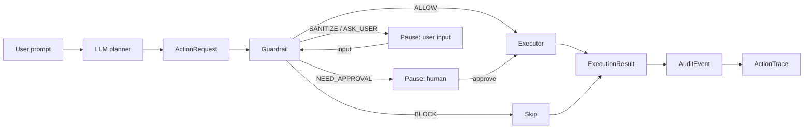

# Architecture

AgentGate is a **modular monolith** (Python 3.11, FastAPI, SQLAlchemy 2, Alembic, PostgreSQL/JSONB,
Playwright). Decisions behind it: [ADR 0001](decisions/0001-architecture-foundation.md) (modular monolith),
[ADR 0002](decisions/0002-local-first-cli.md) (local-first CLI runtime), and
[ADR 0003](decisions/0003-embedded-guardrail-engine.md) (embedded guardrail engine).

## Runtime chain

Every guarded action produces this chain; each record carries `schema_version`, `run_id`, `action_id`:



## Two runtimes, one core

| | Local CLI | Server |
|-|-----------|--------|
| Entry | `agentgate` (`app/cli`) | `uvicorn app.main:app` |
| Process | One foreground process | Long-running FastAPI service |
| Storage | SQLite + `guardrail.jsonl` in a private data dir | PostgreSQL (`audit_logs`) or JSONL |
| Credentials | OS keychain / env / session | `.env` plus `oauth_tokens` table |
| Approvals | Interactive terminal prompt | `POST /chat/execute/{run_id}/respond` or Telegram |
| Guardrail | Same engine | Same engine |

The CLI runtime (`app/runtime`, `app/storage/local`) swaps in local implementations of audit, tokens, and
sanitizing through a runtime context; connectors and the loop are shared. Per ADR 0002 the CLI targets one user,
one profile, and one foreground run at a time (a per-profile lock rejects a second active run); the HTTP server
is a later adapter over the same application service. Local-first does not mean offline: LLM and connector
calls still leave the machine.

## Reactive agent loop

```
plan -> ( guardrail -> approve / sanitize / execute -> observe -> replan )*
```

- Each step is guardrail-checked **individually** before it runs.
- `NEED_APPROVAL`, sanitize, and `ASK_USER` steps **pause** the run until a response arrives.
- On failure, or when the plan is exhausted, the LLM **re-plans** (bounded by `AGENT_MAX_REPLAN`,
  `AGENT_MAX_STEPS`, `AGENT_RUN_TIMEOUT_SEC`).
- Live run state is held in an in-memory registry (`RUN_REGISTRY_MAX_SESSIONS`). The durable record is the audit store.
- Run statuses: `running`, `waiting_approval`, `waiting_input`, `done`, `failed`, `blocked`, `declined`, `error`, `cancelled`.

## Module map

| Path | Responsibility |
|------|----------------|
| `app/api/v1/` | Routers: health, runs, actions, audits, approvals, benchmark, chat, oauth, stripe, telegram |
| `app/cli/`, `app/runtime/`, `app/storage/local/`, `app/credentials/` | Local CLI, local runtime, SQLite storage, credential stores |
| `app/core/` | Contracts: `action_schema`, `executor_schema`, `audit_schema`, `browser_schema`, `run_schema`, `errors` |
| `app/domains/agent/` | Planner, agent loop, guarded execution, run registry/service, browser sessions and prototype agent |
| `app/domains/guardrail/` | Decision adapters (`agentgate`, legacy rules, LLM judge), sensitive-input detection; `_vendor/agentgate` is the embedded engine |
| `app/domains/audit/` | Audit repositories (PostgreSQL and JSONL) |
| `app/domains/approval/` | Approval schemas, services, repositories |
| `app/domains/connector/` | `BaseConnector`; `filesystem`, `github`, `gmail`, `calendar`, `telegram`, `stripe` |
| `app/domains/oauth/` | OAuth authorize/callback/refresh and token storage |
| `app/domains/browser/` | Snapshot, selector map, and Playwright executor |
| `app/executors/` | `ExecutionRouter`, `APIExecutor`, `BrowserExecutor` |
| `app/llm/` | Provider client (OpenAI / Anthropic / Gemini dialects), planner parser, accessibility tool |
| `app/tracing/` | `LatencyTracker`, `TraceWriter` |
| `app/database/` | Async session, URL/TLS handling, ORM models, Alembic migrations |
| `fe/` | Static browser demo |
| `app/demo/` | Browser demo scripts and artifact saving |

## Decision routing

`ExecutionRouter.route(action, decision)`:

- `BLOCK` -> not executed, status `BLOCKED`
- `NEED_APPROVAL` -> not executed, status `PENDING_APPROVAL`
- otherwise -> `BrowserExecutor` if `target_system == "browser"` or `action_type` starts with `BROWSER_`,
  else `APIExecutor`

`APIExecutor` picks a connector by `target_system` and requires `payload.action`. `BrowserExecutor` drives the
same Playwright pipeline used by multi-step browser plans.

## Browser pipeline

The planner sees short element IDs only; selectors stay server-side.

```
ARIA snapshot -> semantic elements (+ risk_hint) -> DOM inspection -> matcher (element_id)
              -> locator candidates -> ranker (selector_map) -> executor (click / fill / ...)
```

Consecutive `BROWSER_*` steps sharing a URL run as a batch in one Playwright session. By default a batch writes
one combined audit row; with `ATOMIC_BROWSER_AUDIT=true` each step gets its own row (see [audit-design](audit-design.md)).

## Integrations as channels

Telegram can start runs (webhook -> shared `start_agent_run()` -> the same loop) and receives approval
callbacks. Stripe events are reconciled through a signed webhook. See [connectors](connectors.md).
