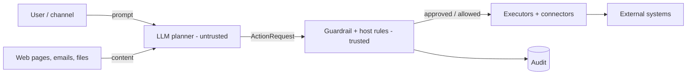

# Security and threat model

AgentGate is a control point between an **untrusted, non-deterministic planner** (an LLM that can be
manipulated by content it reads) and **real systems** (mail, calendar, code, money, browsers). This page states
what it defends, where the trust boundaries are, and what it does not cover.

## Assets

| Asset | Where it lives |
|-------|----------------|
| Provider credentials (OAuth tokens, bot token, Stripe key, LLM key) | Keychain / env (CLI); `.env` and `oauth_tokens` table (server) |
| User data reachable through connectors | Gmail, Calendar, GitHub, local files, web pages |
| Money movement | Stripe Checkout and refunds |
| The audit trail | `audit_logs`, `guardrail.jsonl`, SQLite |

## Trust boundaries

Treat everything left of the guardrail as untrusted, including the planner's `risk_hint`, `domain`, and
`confidence`.

## Threats and mitigations

| Threat | Mitigation | Residual risk |
|--------|-----------|---------------|
| **Prompt injection** from page/email/file content steering the planner | Prompt-injection detector (BLOCK); host allowlist of operations; approval for external effects | Detector is an LLM: it can miss novel attacks |
| **Planner lies about risk** (wrong `risk_hint`/`domain`) | Trusted per-operation hints; domain fallback by target system; hints can only raise the floor | Operations not yet classified default to policy rules |
| **Unknown or new operation** | Unregistered operations are `BLOCK` | None by design |
| **Secret exfiltration** (key in an outbound payload) | Secret patterns and detector; `BLOCK` on egress; secrets masked before reaching Ollama | Unusual secret formats may not match |
| **PII leakage** in external sends | PII policy: `SANITIZE` (redact) or approval; bulk PII egress `BLOCK` | Detector accuracy |
| **Destructive/irreversible action** | Approval; higher risk without rollback | Human approver fatigue |
| **Unauthorized payments / refunds** | Server-side price allowlist, quantity cap, approval, test-mode first, signed webhooks | Live keys widen blast radius |
| **Path traversal / arbitrary file read** | Resolved-path allowlist | Misconfigured `ALLOWED_FILESYSTEM_PATHS` |
| **Detector outage** | Fail closed: approval required; failed evaluation persistence blocks execution | Availability: autonomy stops |
| **Tampering with audit** | DB trigger blocks UPDATE/DELETE; CLI SQLite triggers | A DB owner or superuser can drop triggers or the table |
| **Forged webhooks** | Stripe HMAC + tolerance; Telegram secret header | Depends on secret strength |
| **Wrong recipient** | Telegram names resolved to numeric IDs before approval, shown in the approval view | Contact registry is populated from inbound messages |
| **Approval bypass in automation** | CLI: no `--yes`; non-interactive runs exit 3 | Server approval endpoint has no authentication (below) |

## Known gaps (fix before exposing publicly)

1. **No API authentication or authorization.** Any client that can reach the server can start runs and approve
   or decline steps. Put it behind an authenticating gateway or bind it to localhost.
2. **CORS is `*`.** Acceptable for a local demo, not for a shared deployment.
3. **OAuth tokens are stored unencrypted** in `oauth_tokens` (`access_token`, `refresh_token`) in server mode.
   ADR 0002 identifies this as a server-side seam: the CLI keeps credentials in the OS keychain and its SQLite
   holds only references and scope/expiry metadata, never silently falling back to plaintext. For the server, use
   disk/database encryption and restrict DB access, or add application-level encryption.
4. **OAuth `state` is kept in process memory** (`_pending_states`), so authorization must complete on the same
   process, and multi-worker deployments will fail callbacks.
5. **Live run state is in memory.** Approvals pending at restart are lost; the audit row remains as
   `PENDING_APPROVAL`.
6. **Tracked env templates.** `.env.development` and `.env.staging` are committed; never put real secrets in them.
7. **Sensitive data still goes to the LLM provider.** Prompts and observations reach the configured planner.
   The CLI masks known credential values from outgoing context; the coverage is patterns, not every secret.
8. **Data retention is unenforced.** `*_RETENTION_DAYS` settings exist, but no cleanup job was found.
9. **Approval is human-judgment.** The approval view shows action, target, payload, risk, and reasons; reviewers
   still need to read it.
10. **Audit is not tamper-proof against the operator** (stated in the CLI docs). Ship logs to an external,
    append-only sink if you need that.

## Hardening checklist

- [ ] Run behind an authenticating reverse proxy; restrict CORS origins.
- [ ] Use least-privilege credentials: read-only tokens where possible, Stripe **test** keys until reviewed,
      Telegram bot with minimal chat access.
- [ ] Keep `GUARDRAIL_BACKEND=agentgate`; monitor Ollama health.
- [ ] Set `ALLOWED_FILESYSTEM_PATHS` and `LOCAL_FILE_ROOT` to the narrowest directories.
- [ ] Encrypt the database volume and backups; restrict who can connect.
- [ ] Rotate provider secrets; store them in a secret manager, not tracked files.
- [ ] Set webhook secrets; rotate them if leaked.
- [ ] Back up and forward audit tables; alert on `BLOCKED` and `FAILED` spikes.
- [ ] Review policy pack rules and hint lists before adding new connectors.
- [ ] Use Google OAuth test users / limited scopes; revoke tokens on decommission (`agentgate disconnect`).

## Reporting

No security contact is defined in the repository. Add a `SECURITY.md` with a contact and disclosure process
before making the project public.
