# Jawaban Pertanyaan Integrasi Frontend AgentGate

Dokumen ini menjawab pertanyaan integrasi frontend berdasarkan implementasi server dan [dokumentasi flow API](app/api/flow_api.md) saat ini.

## Konteks identitas yang perlu dipahami FE

Frontend baru sebaiknya menggunakan `X-AgentGate-Session`, bukan `X-AgentGate-Owner`.

| Header | Nilai | Sumber | Fungsi saat ini |
|---|---|---|---|
| `X-AgentGate-Session` | ID acak dari `POST /api/v1/sessions` | Diterbitkan backend | Bearer session sementara untuk membatasi run, action, audit, approval, histori, serta koneksi dan kontak Telegram |
| `X-AgentGate-Owner` | Label bebas dari klien, maksimal 255 karakter | Ditentukan sendiri oleh klien legacy | Kompatibilitas klien lama; bukan autentikasi dan bukan authorization token |

Jika `X-AgentGate-Session` diberikan, backend memvalidasi sesi tersebut dan mengabaikan jalur owner legacy. Session ID yang invalid, kedaluwarsa, atau sudah berakhir menghasilkan HTTP 401 dan tidak akan fallback ke `X-AgentGate-Owner`.

Jika kedua header tidak dikirim, endpoint yang masih mendukung mode legacy memakai owner literal `default`. Karena nilai `X-AgentGate-Owner` dapat dipilih sendiri oleh klien, header ini tidak memberikan isolasi keamanan yang kuat. Pengguna yang mengetahui label owner lain dapat mengirim label yang sama. Isolasi demo yang lebih baik hanya diperoleh dengan session ID acak, tetapi session tersebut tetap belum menggantikan autentikasi pengguna.

OAuth merupakan pengecualian penting: token GitHub, Gmail, dan Calendar masih disimpan global per provider dan belum mengikuti scope owner/session.

### Ringkasan header yang dikirim FE

| Endpoint | Header untuk FE baru | Catatan |
|---|---|---|
| `POST /api/v1/sessions` | Tidak ada | Membuat session ID baru |
| `POST /api/v1/sessions/heartbeat` | `X-AgentGate-Session` | Memastikan sesi masih aktif |
| `POST /api/v1/sessions/end` | Tidak ada; ID ada di body | Mengakhiri sesi yang disebut dalam body |
| `POST /api/v1/chat/execute` | `X-AgentGate-Session` | Session menjadi owner run |
| `POST /api/v1/chat/execute/stream` | `X-AgentGate-Session` | Session menjadi owner run dan stream |
| `GET /api/v1/chat/execute/{run_id}` | Session yang membuat run | Scope berbeda mendapat 404 |
| `POST /api/v1/chat/execute/{run_id}/respond` | Session yang membuat run | Scope berbeda mendapat 404 |
| `GET /api/v1/runs`, `/api/v1/runs/{run_id}/actions` | `X-AgentGate-Session` | Hanya audit dalam scope yang sama |
| `GET /api/v1/approvals`, `/api/v1/audits`, `/api/v1/benchmark` | `X-AgentGate-Session` | Hasil difilter berdasarkan scope |
| Endpoint OAuth | Tidak ada | Status dan token masih global |

Respons HTTP yang paling relevan untuk flow FE:

| HTTP | Makna untuk FE |
|---|---|
| 200 | Request diterima; tetap periksa status bisnis di body/event |
| 401 | Session ID tidak ada pada endpoint wajib-session, invalid, kedaluwarsa, atau sudah berakhir |
| 404 | Run/action/step tidak ditemukan atau berada di scope lain |
| 409 | Step ada, tetapi tidak sedang menunggu jenis jawaban yang dikirim |
| 422 | Body, query, path, atau header gagal validasi schema |

Setelah response SSE berstatus 200 dan stream sudah dimulai, error lifecycle dikirim sebagai event `error`; status HTTP tidak dapat diubah lagi menjadi 4xx/5xx.

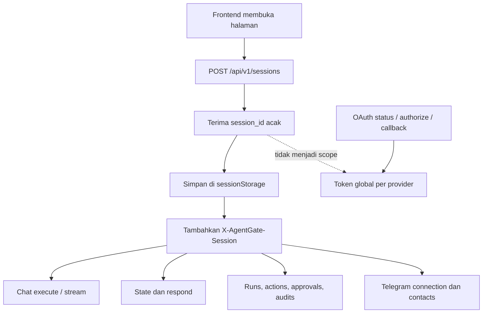

Lifecycle session yang dipakai FE demo:

1. `POST /api/v1/sessions` mengembalikan `session_id` dan `idle_ttl_seconds`.
2. FE menyimpan ID di `sessionStorage`, bukan cookie.
3. FE demo mengirim `POST /api/v1/sessions/heartbeat` setiap dua menit selama halaman aktif.
4. Setiap endpoint yang memakai session juga menyentuh aktivitas session, sehingga heartbeat bukan satu-satunya request yang mempertahankannya.
5. `POST /api/v1/sessions/end` menerima `session_id` di body dan tidak membutuhkan header session. Endpoint ini juga menerima body JSON bertipe `text/plain` agar dapat dipanggil melalui `navigator.sendBeacon`.
6. Jika cleanup browser tidak terkirim, backend sweeper mengakhiri session setelah idle TTL, yang saat ini 1.800 detik.

Contoh penutupan session:

```http
POST /api/v1/sessions/end
Content-Type: application/json

{
  "session_id": "<session-id>",
  "reason": "refresh"
}
```

Nilai `reason` yang diterima adalah `pagehide`, `refresh`, `reset`, atau `replaced`. Response `{"ended":false}` dengan HTTP 200 berarti ID berbentuk valid tetapi session tidak ditemukan atau sudah lebih dahulu berakhir.

## 1. `POST /api/v1/chat/execute`

### Kapan FE menggunakan endpoint ini?

Endpoint ini adalah jalur eksekusi **tanpa SSE**. Backend membuat run, menjalankannya sebagai background task, lalu langsung mengembalikan identitas dan endpoint pelacakan.

Gunakan `/chat/execute` ketika:

- FE tidak membutuhkan event progres secara real-time.
- Klien tidak dapat mempertahankan koneksi HTTP streaming.
- FE lebih nyaman memakai polling berkala.
- FE membutuhkan lifecycle yang tidak bergantung pada koneksi stream tetap terbuka.
- Kemampuan pulih dari gangguan jaringan lebih penting daripada detail event real-time.

Gunakan `/chat/execute/stream` ketika FE ingin menampilkan event perencanaan, guardrail, perubahan status step, hasil eksekusi, dan daftar field `awaiting_input` secara langsung.

| Pertimbangan | `/chat/execute` | `/chat/execute/stream` |
|---|---|---|
| Transport progres | Polling GET | SSE melalui response POST |
| Run tetap berjalan ketika request awal selesai | Ya | Ya selama stream tetap tersambung |
| Putus koneksi klien | Run tidak dibatalkan hanya karena satu polling gagal | Server membatalkan run ketika disconnect stream terdeteksi |
| Detail event real-time | Tidak | Ya |
| Field `awaiting_input` | Belum lengkap pada GET state | Tersedia pada `data.fields` |
| Resume stream berdasarkan `run_id` | Tidak berlaku | Belum tersedia |
| Cocok untuk recovery jaringan | Lebih cocok | Terbatas |

### Flow setelah memperoleh `run_id`

Flow yang diharapkan adalah:

```text
POST /api/v1/chat/execute
  -> simpan run_id
  -> GET /api/v1/chat/execute/{run_id} setiap 1–2 detik
  -> jika waiting_approval atau waiting_input: POST .../{run_id}/respond
  -> lanjutkan GET state sampai status terminal
  -> GET /api/v1/runs/{run_id}/actions untuk audit final
```

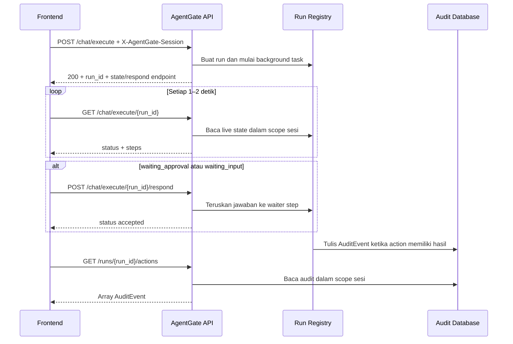

Contoh response awal:

```json
{
  "run_id": "run_634a174c8449",
  "status": "running",
  "prompt": "Read file sample.txt",
  "stream_endpoint": "/api/v1/chat/execute/stream",
  "respond_endpoint": "/api/v1/chat/execute/run_634a174c8449/respond",
  "state_endpoint": "/api/v1/chat/execute/run_634a174c8449"
}
```

FE minimal perlu menyimpan `run_id`, `state_endpoint`, dan `respond_endpoint`. `prompt` dapat dipakai untuk tampilan, sedangkan `status` pada response awal hampir selalu merupakan status awal dan tidak boleh dianggap hasil akhir.

Header `X-AgentGate-Session` yang sama harus dikirim pada execute, polling state, respond, dan pembacaan histori.

HTTP 200 dari endpoint execute hanya berarti run berhasil dibuat. Action belum tentu selesai atau berhasil. FE berhenti polling ketika status run menjadi salah satu dari:

- `done`
- `failed`
- `blocked`
- `declined`
- `error`
- `cancelled`

`stream_endpoint` yang terdapat pada response **bukan** endpoint untuk memasang stream ke `run_id` tersebut. Memanggil `POST /chat/execute/stream` akan membuat run baru. Setelah memilih `/chat/execute`, live tracking untuk run itu dilakukan melalui `GET /chat/execute/{run_id}`.

Endpoint histori seperti `/runs/{run_id}/actions` dan `/audits?run_id=...` membaca audit yang sudah ditulis. Endpoint tersebut bukan pengganti live state karena run yang baru dibuat mungkin belum mempunyai audit.

Contoh loop polling sederhana:

```javascript
async function pollRun(runId, sessionId) {
  while (true) {
    const response = await fetch(`/api/v1/chat/execute/${runId}`, {
      headers: { "X-AgentGate-Session": sessionId },
    });

    if (response.status === 401) throw new Error("Session sudah berakhir");
    if (response.status === 404) throw new Error("Run tidak ditemukan dalam session ini");
    if (!response.ok) throw new Error(`Gagal membaca run: HTTP ${response.status}`);

    const state = await response.json();
    renderRunState(state);

    if (["done", "failed", "blocked", "declined", "error", "cancelled"]
        .includes(state.status)) {
      return state;
    }
    await new Promise(resolve => setTimeout(resolve, 1500));
  }
}
```

Kode tersebut hanya contoh pola. FE perlu menghentikan timer ketika component di-unmount dan mencegah beberapa polling loop berjalan untuk `run_id` yang sama.

## 2. `POST /api/v1/chat/execute/stream`

### Apa nilai `X-AgentGate-Owner`?

`X-AgentGate-Owner` adalah label owner legacy, misalnya:

```http
X-AgentGate-Owner: user-a
```

Nilai tersebut bukan authorization token dan bukan session ID yang diterbitkan backend. Klien lama menentukan nilainya sendiri. Bila header tidak dikirim, backend memakai owner `default`.

Frontend browser saat ini sebaiknya tidak membuat `X-AgentGate-Owner`. FE melakukan inisialisasi berikut:

```http
POST /api/v1/sessions
```

Contoh response:

```json
{
  "session_id": "opaque-random-session-id",
  "idle_ttl_seconds": 1800
}
```

Kemudian FE mengirim:

```http
POST /api/v1/chat/execute/stream
X-AgentGate-Session: <session_id>
Content-Type: application/json
Accept: text/event-stream

{"prompt":"Kirim pesan halo lewat Telegram"}
```

Endpoint stream memakai POST, sehingga `EventSource` browser standar tidak dapat dipakai langsung. FE demo menggunakan `fetch` dan membaca `ReadableStream` serta frame SSE secara bertahap.

Setiap frame mempunyai nama event dan JSON pada baris `data`:

```text
event: run_started
data: {"run_id":"run_xxx","type":"run_started","data":{"status":"running"}}

event: awaiting_approval
data: {"run_id":"run_xxx","type":"awaiting_approval","data":{"index":0,"decision":"NEED_APPROVAL"}}

```

Potongan jaringan tidak selalu sama dengan satu frame. Satu chunk dapat berisi setengah frame atau beberapa frame sekaligus. FE perlu mengumpulkan buffer sampai menemukan pemisah baris kosong, kemudian memproses frame lengkap. Baris `: ping` adalah heartbeat dan tidak perlu dimasukkan sebagai event bisnis.

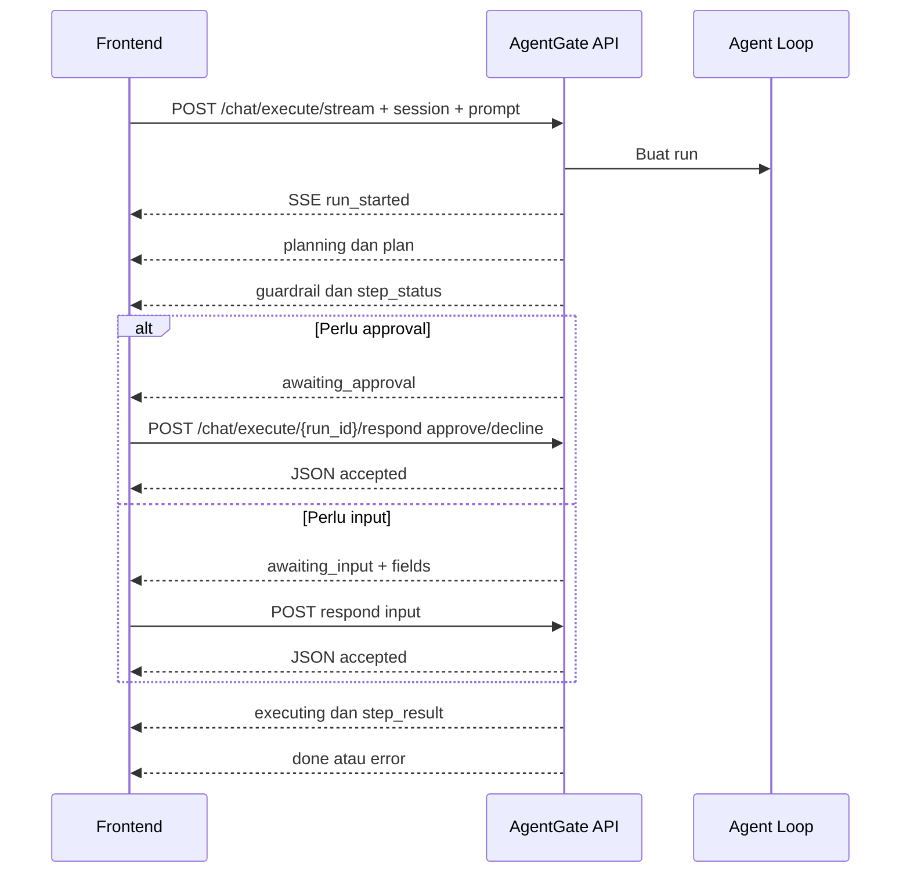

Daftar event yang perlu dikenali FE:

| Event | Data penting | Respons FE |
|---|---|---|
| `run_started` | `run_id`, status awal | Simpan `run_id` segera |
| `planning` | `run_id` | Tampilkan proses perencanaan |
| `plan` | `plan`, summary, provider | Buat atau perbarui daftar step |
| `guardrail` | decision, risk, reasons, index | Tampilkan hasil evaluasi |
| `step_status` | `index`, `status` | Perbarui status step |
| `awaiting_approval` | `index`, decision dan reasons | Tampilkan tombol Approve/Decline |
| `awaiting_input` | `index`, `fields` | Bangun form dan simpan metadata field sampai dijawab |
| `executing` | index dan target/action | Tampilkan indikator eksekusi |
| `step_result` | status, summary, result | Tampilkan hasil; audit lengkap dibaca terpisah |
| `replanning` | iteration | Tampilkan bahwa rencana diperbarui |
| `done` | status terminal dan steps | Tutup pembacaan stream secara normal |
| `error` | message | Tampilkan error dan tutup stream |

### Resource apa yang mengikuti scope sesi?

Session ID menjadi scope untuk:

- live run dan endpoint `/respond`;
- action dan audit;
- daftar run dan benchmark;
- hasil `/approvals`;
- koneksi Telegram utama;
- undangan dan kontak Telegram sementara;
- resolusi penerima Telegram dalam run tersebut.

Token OAuth GitHub, Gmail, dan Calendar **tidak** mengikuti scope ini. Token OAuth masih global per provider pada deployment saat ini.

### Apa yang terjadi saat refresh atau membuka tab baru?

Perilaku FE demo saat ini adalah satu tab mempunyai satu sesi sementara:

- halaman dibuka: membuat session ID baru;
- refresh: mengakhiri sesi lama lalu membuat sesi baru;
- Reset: mengakhiri sesi lama lalu membuat sesi baru;
- tab ditutup atau berpindah halaman: mencoba mengakhiri sesi melalui `pagehide`;
- cleanup browser gagal: backend mengakhiri sesi setelah 30 menit tanpa aktivitas.

Dengan demikian, refresh tidak mempertahankan owner/session lama. Run aktif sesi lama dihapus dari registry dan dibatalkan, sementara audit serta catatan lifecycle sesi tetap tersimpan di database. Sesi baru tidak dapat membaca resource sesi lama.

Tab baru juga membuat session ID sendiri. Jika produk nantinya membutuhkan identitas pengguna yang bertahan antar-refresh atau antar-device, sistem perlu autentikasi dan model kepemilikan persisten; session demo sekarang tidak menyediakan perilaku itu.

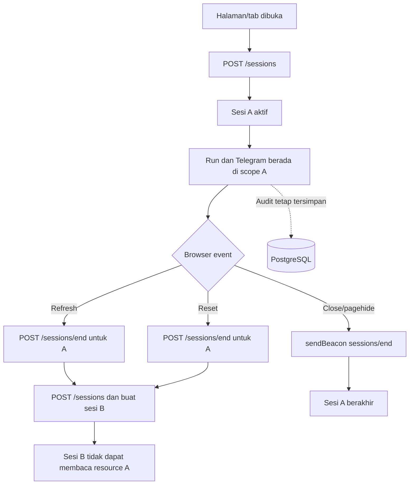

Saat sesi berakhir, backend menghapus run sesi tersebut dari registry, mencabut link Telegram yang belum dipakai, menghapus kontak/undangan Telegram sementara, dan memutus koneksi Telegram sesi. Baris lifecycle sesi dan audit action yang sudah tercatat tetap disimpan.

### Bagaimana jika koneksi SSE terputus?

Implementasi saat ini tidak menyediakan reconnect atau resume SSE untuk run yang sama:

- tidak ada endpoint subscribe berdasarkan `run_id`;
- tidak ada `Last-Event-ID` atau event replay;
- `POST /execute/stream` ulang membuat run baru;
- ketika server mendeteksi koneksi stream terputus saat run masih berjalan atau menunggu interaksi, backend membatalkan task dan mengubah run menjadi `cancelled`.

Jika koneksi terputus, FE sebaiknya:

1. Memanggil `GET /api/v1/chat/execute/{run_id}` dengan session ID yang sama untuk memeriksa status terakhir.
2. Jika status sudah `cancelled`, tampilkan bahwa eksekusi terhenti.
3. Membaca `/runs/{run_id}/actions` untuk mengetahui action yang sempat diaudit.
4. Tidak otomatis memanggil `/execute/stream` dengan prompt yang sama karena itu dapat membuat eksekusi baru dan berisiko menduplikasi action yang sudah terjadi.

Jika kebutuhan utama FE adalah recovery setelah koneksi putus, gunakan `/chat/execute` dengan polling sejak awal.

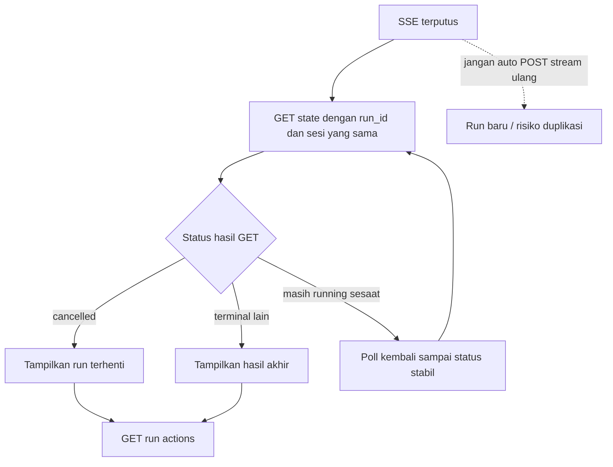

## 3. `GET /api/v1/chat/execute/{run_id}`

### Apakah FE perlu mengirim identitas yang sama?

Ya. FE baru perlu mengirim `X-AgentGate-Session` yang sama dengan session saat run dibuat. Klien legacy perlu mengirim `X-AgentGate-Owner` yang sama.

Contoh:

```http
GET /api/v1/chat/execute/run_xxx
X-AgentGate-Session: <session_id-pembuat-run>
```

Jika User A dan User B memakai session ID yang berbeda, User B memperoleh HTTP 404 saat mencoba membaca run User A meskipun mengetahui `run_id`. HTTP 404 dipakai agar keberadaan run di scope lain tidak dibocorkan.

Perlindungan ini berlaku selama session ID A tetap rahasia. Session ID adalah bearer credential: siapa pun yang memperoleh nilainya dapat bertindak sebagai sesi tersebut. Mode `X-AgentGate-Owner` tidak memberi jaminan serupa karena label owner dapat ditiru oleh klien lain.

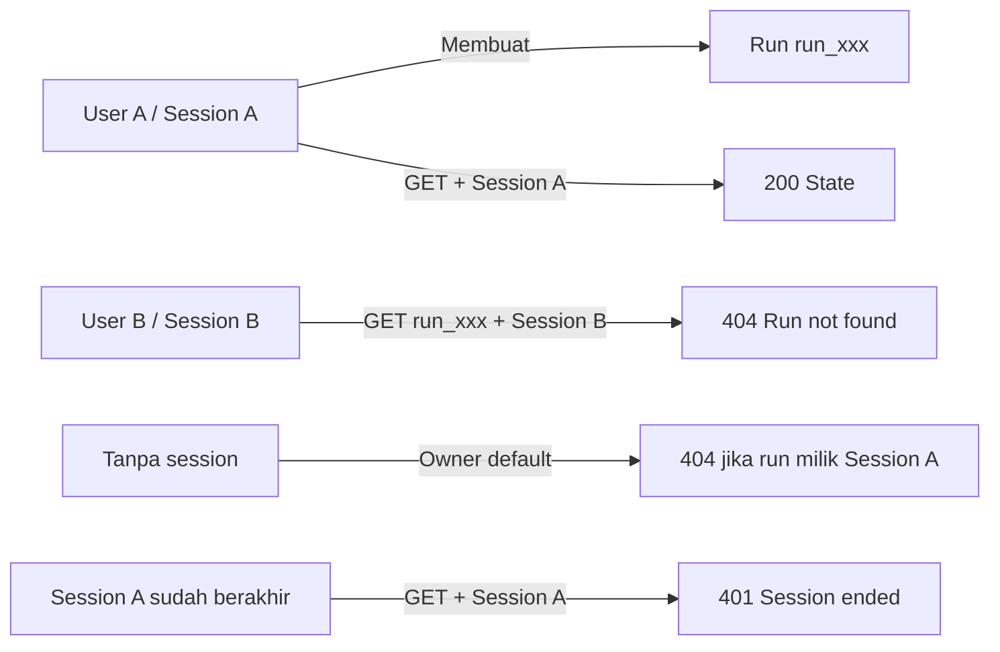

Perbedaan 401 dan 404 untuk flow ini:

| Kondisi | Hasil |
|---|---|
| Session ID valid dan merupakan pembuat run | 200 |
| Session ID valid tetapi run milik session lain | 404 |
| Session ID invalid, kedaluwarsa, atau sudah berakhir | 401 |
| Run tidak ada di registry | 404 |
| Tanpa header untuk run session browser | 404 karena request masuk sebagai owner legacy `default` |

### Apakah endpoint ini hanya untuk refresh atau fallback?

Tidak. Endpoint ini mempunyai dua kegunaan:

1. Sebagai mekanisme live tracking utama untuk flow `POST /chat/execute` tanpa SSE.
2. Sebagai endpoint inspeksi/fallback untuk melihat state terakhir dari run yang masih ada di registry.

Ketika SSE berjalan normal, FE tidak perlu memanggil GET state setiap kali menerima event SSE. Event SSE dapat langsung memperbarui UI. FE dapat melakukan GET state bila ingin melakukan rekonsiliasi sesekali atau memeriksa kondisi setelah gangguan.

Contoh bentuk state:

```json
{
  "run_id": "run_xxx",
  "status": "waiting_approval",
  "prompt": "Kirim pesan halo lewat Telegram",
  "created_at": "2026-09-22T10:00:00+00:00",
  "steps": [
    {
      "index": 0,
      "action_id": "act_xxx",
      "status": "waiting_approval",
      "data": {
        "target_system": "telegram",
        "action_type": "API_CALL",
        "target": "Muhammad Arsyad",
        "payload": {
          "action": "send_message",
          "text": "halo"
        }
      },
      "decision": {
        "decision": "NEED_APPROVAL",
        "risk_level": "HIGH",
        "risk_score": 0.6,
        "reasons": ["External send requires approval"]
      },
      "execution": null,
      "sanitize_fields": null,
      "audit_event": null
    }
  ]
}
```

Contoh tersebut bersifat ilustratif. Data sensitif dan alamat internal tertentu dimasking atau tidak ditampilkan pada public state.

### Apakah state cukup untuk memulihkan interaction setelah refresh?

Belum sepenuhnya, karena ada tiga batas implementasi saat ini:

1. FE demo mengakhiri sesi lama saat refresh. Sesi baru mendapat HTTP 404 ketika membaca run sesi lama, sedangkan ID sesi lama yang sudah berakhir menghasilkan HTTP 401.
2. Putusnya stream membatalkan run SSE yang masih berjalan atau menunggu.
3. Response model GET state mencantumkan `sanitize_fields` dan `audit_event`, tetapi serializer aktif belum meneruskan nilainya sehingga keduanya selalu `null`.

Untuk `waiting_approval`, state masih memuat status step dan data keputusan guardrail sehingga cukup untuk menampilkan approval pada polling flow selama sesi dan run masih aktif.

Untuk `waiting_input`, GET state dapat menunjukkan bahwa step sedang menunggu input, tetapi belum membawa daftar nama field yang diperlukan. Daftar tersebut hanya tersedia pada event SSE `awaiting_input.data.fields`. Karena itu sistem sekarang belum dapat memulihkan form input multi-field secara lengkap setelah refresh atau kehilangan event SSE.

| Kondisi pemulihan | Apakah dapat dipulihkan sekarang? | Alasan |
|---|---|---|
| Polling gagal satu kali, sesi tetap aktif | Ya | Ulangi GET state |
| UI kehilangan beberapa event tetapi SSE belum diputus | Sebagian | GET state merekonsiliasi status/decision/execution |
| Form `waiting_approval` hilang, sesi/run tetap aktif | Ya | Status dan decision tersedia di GET state |
| Form multi-field `waiting_input` hilang | Belum lengkap | `sanitize_fields` pada GET masih `null` |
| SSE benar-benar terputus | Tidak dapat resume stream | Run dibatalkan saat disconnect terdeteksi |
| Halaman demo di-refresh | Tidak | Sesi lama diakhiri dan run dihapus dari registry |
| API direstart | Tidak untuk live run | Registry run masih berada di memori proses |

## 4. `POST /api/v1/chat/execute/{run_id}/respond`

### Apakah identitas owner/session perlu dikirim?

Ya. Kirim `X-AgentGate-Session` yang sama dengan pembuat run. Klien legacy mengirim `X-AgentGate-Owner` yang sama. Run dari scope lain diperlakukan sebagai tidak ditemukan dan menghasilkan 404.

### Kapan masing-masing action dapat digunakan?

| Body action | Status step yang valid | Keterangan |
|---|---|---|
| `approve` | `waiting_approval` | Melanjutkan step ke proses berikutnya |
| `decline` | `waiting_approval` | Menghentikan run sebagai `declined`; action dicatat `SKIPPED` |
| `input` | `waiting_input` | Mengisi nilai atau klarifikasi lalu menjalankan evaluasi berikutnya |

Kombinasi yang tidak sesuai status menghasilkan HTTP 409. Run atau step yang tidak ditemukan atau berada di scope lain menghasilkan 404. Body yang tidak valid menghasilkan 422.

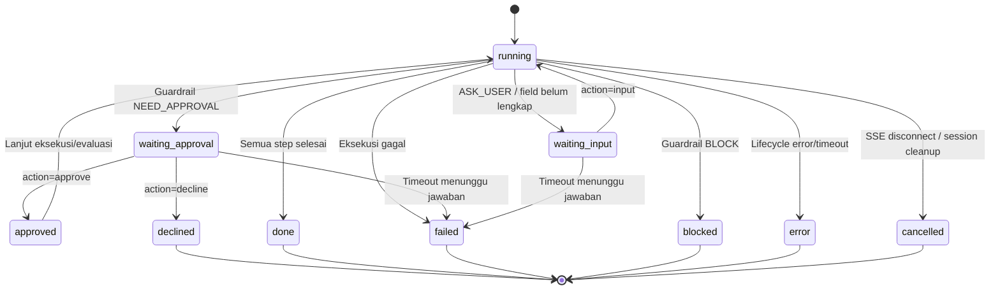

Validasi dilakukan terhadap `step_index`, bukan hanya status run keseluruhan. FE harus memakai indeks dari event/state yang memicu interaction. Mengirim approval untuk step lain atau mengirim jawaban kedua setelah step sudah bergerak akan menghasilkan 409.

### Apa yang dilakukan FE setelah `/respond`?

Jika koneksi SSE masih terbuka, FE cukup menunggu event lanjutan dari stream yang sama. Response `{"status":"accepted"}` hanya berarti jawaban sudah diterima lifecycle; response tersebut belum membuktikan step sudah selesai.

Jika menggunakan flow polling, FE melanjutkan `GET /chat/execute/{run_id}` sampai status berubah atau terminal.

Contoh response `/respond`:

```json
{
  "run_id": "run_xxx",
  "step_index": 0,
  "action": "approve",
  "status": "accepted",
  "step_status": "waiting_approval"
}
```

`step_status` masih dapat bernilai `waiting_approval` pada response tersebut karena request hanya menyerahkan jawaban ke background lifecycle. Perubahan menjadi `approved`, `running`, atau status berikutnya terjadi secara asynchronous dan dikirim melalui SSE atau terlihat pada polling selanjutnya.

### Bagaimana mengirim `awaiting_input`?

Untuk input bernama, key pada `fields` harus mengikuti `data.fields` dari event `awaiting_input`:

```json
{
  "step_index": 1,
  "action": "input",
  "fields": {
    "email": "user@example.com"
  }
}
```

Untuk interaction yang hanya membutuhkan satu jawaban bebas, FE dapat memakai `text`:

```json
{
  "step_index": 1,
  "action": "input",
  "text": "user@example.com"
}
```

`approve` dan `decline` tidak boleh membawa `fields` atau `text`. Setelah input diterima, guardrail dapat mengevaluasi ulang step dan masih mungkin meminta approval.

| Kesalahan `/respond` | HTTP | Tindakan FE |
|---|---|---|
| Session sudah berakhir | 401 | Buat sesi baru; run lama tidak dapat dilanjutkan |
| Run atau step tidak ditemukan / berbeda scope | 404 | Hentikan interaction dan rekonsiliasi state/history |
| Step tidak sedang menunggu jenis jawaban itu | 409 | GET state terbaru; jangan kirim ulang otomatis |
| `action` bukan approve/decline/input | 422 | Perbaiki body |
| Input tidak mempunyai `fields` maupun `text` | 422 | Isi salah satu bentuk input |
| Approve/decline membawa `fields` atau `text` | 422 | Hapus field input dari body |

## 5. `GET /api/v1/runs`

Endpoint ini membaca dan mengagregasi audit yang sudah tersimpan. Response berisi ringkasan seperti `run_id`, jumlah action yang sudah diaudit, status audit terakhir, dan waktu pembaruan terakhir.

Contoh response:

```json
[
  {
    "run_id": "run_xxx",
    "action_count": 2,
    "latest_status": "SUCCESS",
    "updated_at": "2026-09-22T10:05:00+00:00"
  }
]
```

`latest_status` adalah `ExecutionStatus` audit dalam huruf kapital, bukan `RunStatus` live. Sebuah run live dapat berstatus `declined`, sedangkan action terakhirnya tercatat sebagai `SKIPPED`.

FE perlu mengirim `X-AgentGate-Session` yang aktif. Backend hanya memasukkan audit yang mempunyai `session_id` yang sama. Klien legacy dapat memakai `X-AgentGate-Owner`; tanpa kedua header, endpoint membaca audit milik owner legacy `default`.

Hal yang perlu diperhatikan:

- Run yang masih aktif tetapi belum menulis audit belum muncul pada `/runs`.
- `/runs` bukan daftar seluruh objek live di run registry.
- Refresh FE demo membuat sesi baru, sehingga history sesi lama tidak muncul pada sesi baru walaupun record auditnya tetap ada di database.
- Session scope adalah isolasi sementara, bukan identitas pengguna persisten. Karena itu endpoint ini belum dapat menjadi histori lintas sesi milik akun pengguna.

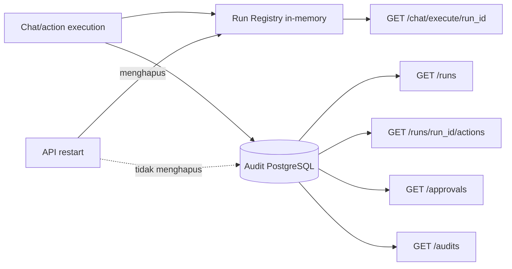

Implikasinya, FE tidak boleh menyamakan `/runs` dengan daftar run yang sedang aktif. Nama endpoint tersebut mewakili agregasi histori action yang sudah diaudit.

## 6. `GET /api/v1/runs/{run_id}/actions`

Endpoint ini dapat dipakai FE untuk halaman detail run, timeline action, hasil eksekusi, alasan guardrail, error, dan informasi audit. Endpoint ini bukan hanya untuk debugging backend, tetapi payload `AuditEvent` cukup teknis sehingga FE perlu memilih field yang relevan untuk ditampilkan kepada pengguna.

Backend mengambil audit berdasarkan `run_id`, lalu memfilter setiap event berdasarkan session/owner pemanggil. FE tetap perlu mengirim `X-AgentGate-Session` yang aktif.

Perilaku ketika tidak ada item:

- run tidak ada;
- run belum menulis audit;
- semua audit run berada di scope owner/session lain;

ketiganya menghasilkan HTTP 200 dengan array kosong `[]`, bukan 404.

Contoh satu `AuditEvent` yang disederhanakan:

```json
{
  "audit_id": "aud_xxx",
  "run_id": "run_xxx",
  "action_id": "act_xxx",
  "request_json": {
    "owner_id": "<session-id>",
    "session_id": "<session-id>",
    "target_system": "telegram",
    "action_type": "API_CALL",
    "payload_summary": "send_message to Muhammad Arsyad"
  },
  "decision_json": {
    "decision": "ALLOW",
    "initial_decision": "NEED_APPROVAL",
    "approval_decision": "approved"
  },
  "execution_json": {
    "status": "SUCCESS",
    "result_summary": "Telegram message sent"
  },
  "execution_status": "SUCCESS",
  "error_type": null,
  "latency": {
    "total_ms": 120
  },
  "created_at": "2026-09-22T10:05:00+00:00"
}
```

Payload di atas ilustratif. `request_json` tidak menyimpan salinan penuh `payload` action. FE juga sebaiknya tidak menampilkan seluruh audit mentah tanpa memilih dan memberi label pada field teknis.

Audit disimpan lebih lama daripada live state. Setelah proses API restart, live state run dapat hilang tetapi audit action yang sudah ditulis tetap dapat tersedia bagi scope yang sesuai. Pada session demo, sesi lama yang sudah berakhir tidak dapat dipakai lagi untuk mengambil audit tersebut melalui API meskipun datanya tetap berada di database.

## 7. `GET /api/v1/approvals`

Untuk flow chat interaktif, FE sebaiknya menggunakan event SSE `awaiting_approval` atau status live `waiting_approval`, kemudian mengirim keputusan ke `/chat/execute/{run_id}/respond`.

`GET /approvals` hanya memfilter audit repository untuk action dengan `execution_status=PENDING_APPROVAL`. Endpoint ini mempunyai beberapa batas:

- step chat dapat sedang menunggu approval sebelum audit final ditulis, sehingga belum tentu muncul di `/approvals`;
- action langsung dari `/actions/run` dapat menghasilkan audit `PENDING_APPROVAL`, tetapi tidak mempunyai waiter atau live step yang dapat dilanjutkan melalui `/respond`;
- endpoint ini tidak menyediakan operasi approve atau decline berdasarkan `audit_id`.

Karena itu `/approvals` lebih cocok untuk dashboard/monitoring pending audit daripada sumber utama interaction chat.

Hasilnya tetap difilter berdasarkan `X-AgentGate-Session` atau owner legacy yang sedang dipakai. Namun item yang muncul tidak boleh langsung dianggap dapat direspons melalui `/respond`; FE harus memastikan live run dan step masih tersedia.

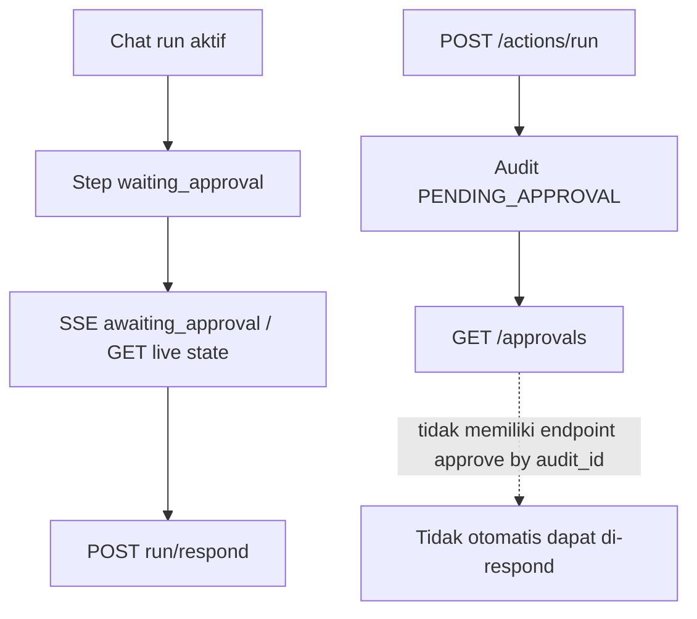

Rekomendasi UI:

- gunakan interaction card pada chat untuk approval yang dapat ditindaklanjuti;
- gunakan `/approvals` sebagai daftar observasi atau dashboard administratif;
- sebelum menampilkan tombol tindakan dari sebuah item `/approvals`, pastikan ada live run dan step `waiting_approval` yang cocok;
- jangan membentuk URL `/respond` hanya dari `audit_id`, karena endpoint respond membutuhkan `run_id` dan `step_index`.

## 8. OAuth: `/oauth/status`, `/authorize`, dan `/callback`

### Apakah credential terikat ke owner/session?

Belum. OAuth GitHub, Gmail, dan Calendar saat ini bersifat global pada deployment:

- endpoint OAuth tidak menerima `X-AgentGate-Session` atau `X-AgentGate-Owner`;
- tabel `oauth_tokens` menyimpan satu record untuk setiap provider;
- record token tidak mempunyai kolom owner/session;
- semua sesi melihat status koneksi OAuth yang sama.

`GET /api/v1/oauth/status` hanya memeriksa apakah record token provider tersedia. Nilai `connected=true` bukan verifikasi langsung bahwa token masih valid di provider dan bukan status milik user/session tertentu.

Contoh response yang dilihat sama oleh seluruh browser session:

```json
{
  "github": {
    "connected": false,
    "scope": null
  },
  "gmail": {
    "connected": false,
    "scope": null
  },
  "calendar": {
    "connected": true,
    "scope": "https://www.googleapis.com/auth/calendar"
  }
}
```

### Bagaimana callback dikaitkan dengan flow authorize?

Endpoint authorize membuat state acak, menyimpan hash state beserta nama provider dan masa berlaku, lalu mengirim nilai state mentah ke provider melalui redirect. Callback memvalidasi bahwa state:

- ada;
- belum dipakai;
- belum kedaluwarsa;
- cocok dengan provider pada URL callback.

State tersebut melindungi korelasi dan CSRF flow OAuth, tetapi tidak menyimpan owner/session pemulai. Setelah callback berhasil, token disimpan pada record global provider tersebut.

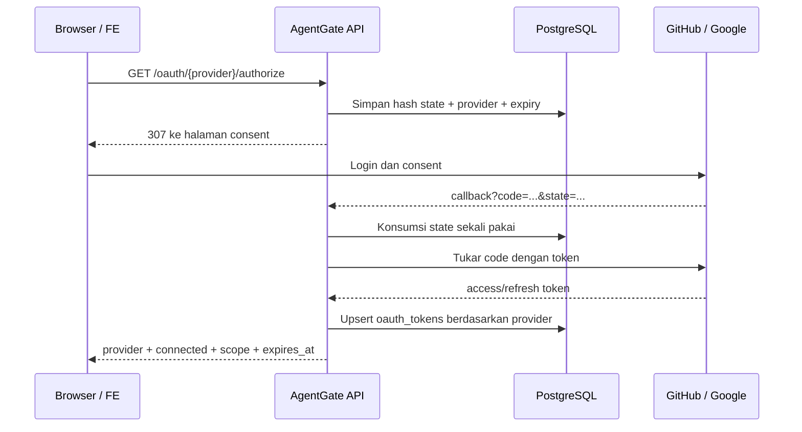

Tidak ada session/owner pada sequence tersebut. Nilai OAuth `state` bukan session ID AgentGate; state adalah token korelasi sementara yang di-hash di database, berlaku sekitar sepuluh menit, dan hanya dapat dikonsumsi sekali. API restart di antara authorize dan callback tidak menghilangkan state karena state sudah persisten di PostgreSQL.

State dikonsumsi sebelum authorization code ditukar. Jika pertukaran token gagal, FE harus memulai authorize baru dan tidak menggunakan ulang callback/state lama.

### Bagaimana jika user menghubungkan lebih dari satu provider atau account?

FE tidak perlu menyimpan identifier token atau account. Backend menangani token berdasarkan nama provider:

```text
github
gmail
calendar
```

GitHub, Gmail, dan Calendar dapat memiliki record token masing-masing. Namun hanya ada satu record untuk setiap provider. Jika OAuth provider yang sama diselesaikan lagi menggunakan account lain, token provider tersebut diperbarui/diganti untuk seluruh deployment.

Tidak ada endpoint OAuth disconnect publik dan tidak ada daftar beberapa account untuk satu provider. Agar OAuth aman untuk aplikasi multi-user, model token perlu ditambah dengan owner pengguna yang berasal dari autentikasi, state authorize perlu menyimpan owner tersebut, dan status/callback/konektor perlu melakukan lookup token berdasarkan owner yang sudah terautentikasi.

| Skenario | Perilaku sekarang |
|---|---|
| Session A menghubungkan Calendar | Token Calendar menjadi global |
| Session B membuka `/oauth/status` | Melihat Calendar `connected=true` yang sama |
| Session B menjalankan action Calendar | Konektor menggunakan token Calendar global tersebut |
| Account Calendar lain menyelesaikan OAuth | Record Calendar global diperbarui/diganti |
| GitHub dan Calendar sama-sama dihubungkan | Keduanya tersimpan karena provider berbeda |
| Dua account Gmail ingin aktif bersamaan | Tidak didukung; hanya satu record Gmail |

## Rekomendasi flow FE dengan sistem sekarang

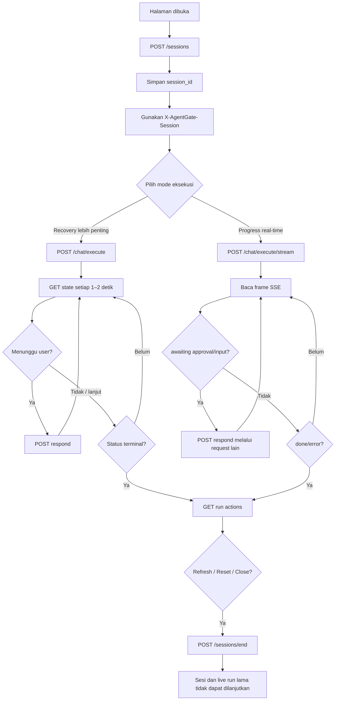

### Checklist implementasi FE

- Buat satu session sebelum memulai request scoped.
- Jangan mengirim session ID melalui `X-AgentGate-Owner`.
- Simpan `run_id` segera setelah response execute atau event `run_started`.
- Gunakan satu mode eksekusi per prompt; jangan memanggil polling execute lalu stream execute untuk prompt yang sama.
- Kirim session yang sama pada GET state, respond, history, audit, dan approval.
- Simpan metadata `awaiting_input.data.fields` di state UI sampai interaction selesai.
- Cegah double-submit tombol Approve/Decline dan input.
- Setelah `/respond` menghasilkan `accepted`, tunggu event/polling berikutnya sebelum menganggap action sukses.
- Jangan otomatis menjalankan ulang prompt setelah disconnect tanpa memeriksa state dan audit.
- Bedakan `RunStatus`, `StepStatus`, dan `ExecutionStatus` audit pada UI.
- Perlakukan HTTP 404 pada resource scoped sebagai tidak tersedia bagi session aktif, tanpa menyimpulkan resource tidak pernah ada.
- Perlakukan OAuth status sebagai status global deployment pada versi sistem sekarang.

Untuk FE yang membutuhkan recovery setelah refresh, resume SSE, histori lintas sesi, atau OAuth per pengguna, backend saat ini masih memerlukan pengembangan lebih lanjut pada autentikasi, penyimpanan run/event persisten, dan ownership token OAuth.
